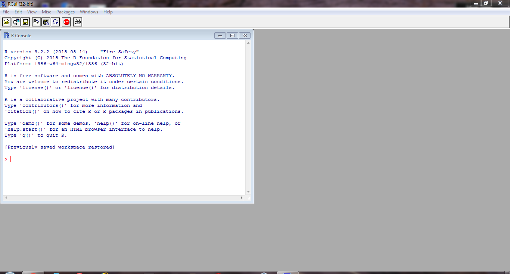

---
title       : Programming in R
subtitle    : A brief introduction
author      : Alex Pacheco
job         : LTS Research Computing
logo        : lu.png
framework   : io2012        # {io2012, html5slides, shower, dzslides, ...}
highlighter : highlight.js  # {highlight.js, prettify, highlight}
hitheme     : tomorrow      # 
widgets     : []            # {mathjax, quiz, bootstrap}
mode        : selfcontained # {standalone, draft}
knit        : slidify::knit2slides
license     : by-sa
--- .class

## History

* R is a dialect of the S language
    - S was initiated at the Bell Labs as an internal statistical analysis environment.
    - Most well known implementation is S‐plus (most recent stable release was in 2010)
* R was first announced in 1993.
* The R core group was formed in 1997, who controls the source code of R (written in C)
* R 1.0.0 was released in 2000
* The current version is 3.4.4 (released on March 15, 2018)

--- .class


## Features

- R is a dialect of the S language
    - Language designed for statistical analysis
    - Similar syntax
- Available on most platform/OS
- Rich data analysis functionalities and sophisticated graphical capabilities
- Active development and very active community
    - CRAN: The Comprehensive R Archive Network
- Source code and binaries, user contributed packages and documentation
    - More than 6,000 packages available on CRAN as of last week
- Free to use

--- .class

## Alternatives to R

* __S-PLUS__: commercial verison of S
* __Gretl__: open-source statistical package, mainly for econometrics
* __SPSS__: widely used program for statistical analysis in social science
* __PSPP__: free alternative to SPSS
* __SAS__: proprietary software that can be used with very large datasets such as census data
* __STATA__: proprietary software that is often used in economics and epidemiology
* __MATLAB__: proprietary software used widely in the mathematical sciences and engineering
* __GNU Octave__: free alternative to MATLAB
* __Python__: general programming language

--- .class 

## Installing R

* R can be installed on Windows, Mac OSX and Linux from [CRAN](https://cran.r-project.org/mirrors.html).
* R version 3.4.1 available as On Demand app on https://software.lehigh.edu




--- .class

## Running R

* [RStudio](https://www.rstudio.com/) is the most popular (de facto) environment for running R on all platforms.
* From Command Line on *NIX
   - Enter `R` on the command line (if you have modified your `PATH` correctly)
* Batch Mode on *NIX
   - Use the `Rscript filename.R` command to execute commands from a file, `filename.R` 

```{sh}
cat hello.R
```

```{sh}
Rscript hello.R
``` 

--- .class

## RStudio

* free and open source IDE for R. Can be installed on Windows, Mac OSX and Linux.
* user interface comparable to other IDEs or software such as MATLAB.
* more suited for development 
* Version 1.0.153 available as On Demand on https://software.lehigh.edu


--- .class

## Get Started with R

* Use the console to use R as a simple calculator

```{r}
1 + 2
```  

* The assignment symbol is "<-". The classical "=" symbol can also be used

```{r}
a=2+3
b<-10/a
a
b
```

--- .class

## Get Started with R

* install packages from CRAN, for e.g. knitr

```{r eval=FALSE}
install.packages('knitr')
```

* load a library, for e.g. knitr

```{r eval=FALSE}
library(knitr)
```

* Help from command line

```
?<command name>
??<part of command name/topic>
```

* or search in the help page in RStudio

* `getwd()`: display current working directory

* `setwd('dir')`: change current working director to `dir`

--- .class

## Data Classes

* R has five atomic classes
* Numeric
    - Double is equivalent to numeric.
    - Numbers in R are treated as numeric unless specified otherwise.
* Integer
* Complex
* Character
* Logical
    - TRUE or FALSE
* You can convert data from one type to the other using the `as.<Type>` functions
* To check the class of an object, use the `is.<Type>` function.

--- .class

## Example

```{r}
a <- 3
b <- sqrt(a)
b
c <- 2i
d <- TRUE
d
as.numeric(d); as.character(b); is.complex(c)
```

--- .class


## Data Objects‐ Vectors

* Vectors can only contain elements of the same class
* Vectors can be constructed by
    -  Using the `c()` function (concatenate)
* Coercion will occur when mixed objects are passed to the `c()` function, as if the `as.<Type>()` function is explicitly called
    -  Using the `vector()` function
* One can use `[index]` to access individual element
    -  Indices start from 1


--- .class

## Examples

```{r}
# "#" indicates comment
# "<-" performs assignment operation (you can use "=" as well, but "<-" is preferred)
# numeric (double is the same as numeric)
d <- c(1,2,3)
# character
d <- c("1","2","3")
# you can covert at object with as.TYPE
# as. numeric changes the character vector created above to numeric
as.numeric(d)
# The conversion doesn't always work though
as.numeric("a")
```

--- .class

## Examples (contd)

```{r}
x <- c(0.5, 0.6) ## numeric
x <- c(TRUE, FALSE) ## logical
x <- c(T, F) ## logical
x <- c("a", "b", "c") ## character
# The ":" operator can be used to generate integer sequences
x <- 9:29 ## integer
x <- c(1+0i, 2+4i) ## complex
x <- vector("numeric", length = 10)
# Coercion will occur when objects of different classes are mixed
y <- c(1.7, "a") ## character
y <- c(TRUE, 2) ## numeric
y <- c("a", TRUE) ## character
# Can also coerce explicitly
x <- 0:6
class(x)
as.logical(x)
```

--- .class


## Vectorized Operations

* Lots of R operations process objects in a vectorized way
    -  more efficient, concise, and easier to read.

```{r}
x <- 1:4; y <- 6:9
x + y
x > 2
x * y
print( x[x >= 3] )
```

--- .class


## Data Objects - Matrices

* Matrices are vectors with a dimension attribute
* R matrices can be constructed
    -  Using the `matrix()` function
	  - Passing an dim attribute to a vector
	  -  Using the `cbind()` or `rbind()` functions
* R matrices are constructed column‐wise
* One can use `[<index>,<index>]` to access individual element

--- .class


## Example
```{r}
# Create a matrix using the matrix() function
m <- matrix(1:6, nrow = 2, ncol = 3)
m
dim(m)
attributes(m)
```

--- .class

## Example

```{r}
# Pass a dim attribute to a vector
m <- 1:10
m
dim(m) <- c(2, 5)
m
```

--- .class

## Example

```{r}
# Row binding and column binding
x <- 1:3
y <- 10:12
cbind(x, y)
rbind(x, y)

```

--- .class

## Example

```{r}
# Slicing
m
# element at 2nd row, 3rd column
m[2,3]
# entire i<sup>th</sup> row of m
m[2,]
# entire j<sup>th</sup> column of m
m[,3]
```

--- .class


## Data Objects - Lists

* Lists are a special kind of vector that contains objects of different classes
* Lists can be constructed by using the `list()` function
* Lists can be indexed using `[[  ]]`

```{r}
# Use the list() function to construct a list
x <- list(1, "a", TRUE, 1 + 4i)
x
```

--- .class


## Data Objects - Data Frames
* Data frames are used to store tabular data
    -  They are a special type of list where every element of the list has to have the same length
    -  Each element of the list can be thought of as a column
    -  Data frames can store different classes of objects in each column
    -  Data frames also have a special attribute called `row.names`
    -  Data frames are usually created by calling `read.table()` or `read.csv()`
          -  More on this later
    -  Can be converted to a matrix by calling `data.matrix()`

--- .class


## Names

* R objects can have names

```{r}
# Each element in a vector can have a name
x <- 1:3
names(x)
names(x) <- c("a","b","c")
names(x)
x
```

--- .class

## Names (contd)

```{r}
# Lists
x <- list(a = 1, b = 2, c = 3)
x
# Names can be used to refer to individual element
x$a
```

--- .class

## Names (contd)

```{r}
# Columns and rows of matrices
m <- matrix(1:4, nrow = 2, ncol = 2)
dimnames(m) <- list(c("a", "b"), c("c", "d"))
m
```

--- .class


## Querying Object Attributes

* The `class()` function
* The `str()` function
* The `attributes()` function reveals attributes of an object (does not work with vectors)
    -  Class
    -  Names
    -  Dimensions
    -  Length
    -  User defined attributes
* They work on all objects (including functions)

--- .class

## Example

```{r}
m <- matrix(1:10, nrow = 2, ncol = 5)
str(matrix)
str(m)
str(str)
```

--- .class


## Data Class - Factors

* Factors are used to represent categorical data.
* Factors can be unordered or ordered.
* Factors are treated specially by modelling functions like `lm()` and `glm()`

```{r}
# Use the factor() function to construct a vector of factors
# The order of levels can be set by the levels keyword
x <- factor(c("yes", "yes", "no", "yes", "no"), levels = c("yes", "no"))
x
```

--- .class


## Date and Time

* R has a Date class for date data while times are represented by POSIX formats
* One can convert a text string to date using the `as.Date()` function
* The `strptime()` function can deal with dates and times in different formats.
* The package "`lubridate`" provides many additional and convenient features

```{r}
# Dates are stored internally as the number of days since 1970-01-01
x <- as.Date("1970-01-01")
x
as.numeric(x)
x+1
```

--- .class

## Data and Time (contd)

```{r}
# Times are stored internally as the number of seconds since 1970-01-01
x <- Sys.time() ; x
as.numeric(x)
p <- as.POSIXlt(x)
names(unclass(p))
p$sec
```

--- .class


## Missing Values

* Missing values are denoted by `NA` or `NaN` for undefined mathematical operations.
    - `is.na()` is used to test objects if they are `NA`
    - `is.nan()` is used to test for `NaN`
    - `NA` values have a class also, so there are integer `NA`, character `NA`, etc.
    - A `NaN` value is also `NA` but the converse is not true

```{r}
x <- c(1,2, NA, 10,3)
is.na(x)
is.nan(x)
```

--- .class

## Missing Values (contd)

```{r}
x <- c(1,2, NaN, NA,4)
is.na(x)
is.nan(x)
```

--- .class

## Arithmetic Functions

<table>
<tr><th>Function</th><th>Description</th></tr>   
<tr><td><code>exp()</code></td><td>     Exponentiation</td></tr>
<tr><td><code>log()</code></td><td>     Natural Logarithm</td></tr>
<tr><td><code>log10()</code></td><td>   Logarithm to base 10</td></tr>
<tr><td><code>sqrt()</code></td><td>    square root</td></tr>
<tr><td><code>abs()</code></td><td>     absolute value</td></tr>
<tr><td><code>sin()</code></td><td>     sine</td></tr>
<tr><td><code>cos()</code></td><td>     cosine</td></tr>
<tr><td><code>floor()</code></td><td>    </td></tr>
<tr><td><code>ceiling()</code></td><td> rounding of numbers</td></tr>
<tr><td><code>round()</code></td><td>   </td></tr>
</table>

--- .class

## Simple Statistic Functions

<table border="1">
<tr><th>Function</th><th>Description</th></tr>
<tr><td><code>min()</code></td><td>minimum value</td></tr>
<tr><td><code>max()</code></td><td>maximum value</td></tr>
<tr><td><code>which.min()</code></td><td>location of minimum</td></tr>
<tr><td><code>which.max()</code></td><td>location of maximum</td></tr>
<tr><td><code>pmin()</code></td><td>elementwise minima of several vectors</td></tr>
<tr><td><code>pmax()</code></td><td>elementwise maxima of several vectors</td></tr>
<tr><td><code>sum()</code></td><td>sum of elements of a vector</td></tr>
<tr><td><code>mean()</code></td><td>mean of elements of a vector</td></tr>
<tr><td><code>prod()</code></td><td>products of elements of a vector</td></tr>
</table>

--- .class


## Distributions and Random Variables

* For each distribution R provides four functions: density (`d`), cumulative density (`p`), quantile (`q`), and random generation (`r`)
    - The function name is of the form `[d|p|q|r]<name of distribution>`
    - e.g. `qbinom()` gives the quantile of a binomial distribution


<table>
<tr><th>Distribution</th><th>Distribution name in R</th></tr>
<tr><td>Uniform</td><td><code>unif</code></td></tr>
<tr><td>Binomial</td><td><code>binom</code></td></tr>
<tr><td>Poisson</td><td><code>pois</code></td></tr>
<tr><td>Geometric</td><td><code>geom</code></td></tr>
<tr><td>Gamma</td><td><code>gamma</code></td></tr>
<tr><td>Normal</td><td><code>norm</code></td></tr>
<tr><td>Log Normal</td><td><code>lnorm</code></td></tr>
<tr><td>Exponential</td><td><code>exp</code></td></tr>
<tr><td>Student’s t</td><td><code>t</code></td></tr>
</table>

--- .class

## Examples: Distributions and Random Variables

```{r}
# Random generation from a uniform distribution.
runif(10, 2, 4)
# You can name the arguments in the function call.
runif(10, min = 2, max = 4)
# Given p value and degree of freedom, find the t-value.
qt(p=0.975, df = 8)
# The inverse of the above function call
pt(2.306, df = 8)
```

--- .class

## User Defined Functions
* Similar to other languages, functions in R are defined by using the `function()` directives
* The return value is the last expression in the function body to be evaluated.
* Functions can be nested
* Functions are R objects
    - For example, they can be passed as an argument to other functions

```{r}
newDef <- function(a,b)
 {
     x = runif(10,a,b)
     mean(x)
 }
newDef(-1,1)
```

--- .class

## Control Structures
* Control structures allow one to control the flow of execution.

<table>
<tr><td><code>if … else</code></td><td>testing a condition</td></tr>
<tr><td><code>for</code></td><td>executing a loop (with fixed number of iterations)</td></tr>
<tr><td><code>while</code></td><td>executing a loop when a condition is true</td></tr>
<tr><td><code>repeat</code></td><td>executing an infinite loop</td></tr>
<tr><td><code>break</code></td><td>breaking the execution of a loop</td></tr>
<tr><td><code>next</code></td><td>skipping to next iteration</td></tr>
<tr><td><code>return</code></td><td>exit a function</td></tr>
</table>

--- .class


## Testing conditions

```{r eval=FALSE}
# Comparisons: <,<=,>,>=,==,!=
# Logical operations: !, &&, ||
if(x > 3 && x < 5) {
  print ("x is between 3 and 5")
} else if(x <= 3) {
  print ("x is less or equal to 3")
} else {
  print ("x is greater or equal to 5")
}
```

--- .class

## For Loops

```{r}
x <- c("a", "b", "c", "d")
# These loops have the same effect
# Loop through the indices
for(i in 1:4) {
  print(x[i])
}
# Loop using the seq_along() function
for(i in seq_along(x)) {
  print(x[i])
}
```

--- .class

## For Loops (contd)

```{r}
# Loop through the name
for(letter in x) {
  print(letter)
}
for(i in 1:4) print(x[i])
```

--- .class &twocol

## while loops

* The `while` loop can be used to repeat a set of instructions
* It is often used when you do not know in advance how often the instructions will be executed. 
* The basic format for a `while` loop is `while(cond) expr`

*** =left

```{r}
sum <- 1
while ( sum < 11 )
{
  sum <- sum + 2;
  print(sum);
}
```

*** =right

```{r}
sum <- 12
while (sum < 11 ) 
{
  sum <- sum + 2;
  print(sum);
}
```

--- .class &twocol

## repeat loops

* The `repeat` loop is similar to the `while` loop. 
* The difference is that it will always begin the loop the first time. The `while` loop will only start the loop if the condition is true the first time it is evaluated. 
* Another difference is that you have to explicitly specify when to stop the loop using the `break` command.

*** =left

```{r}
sum <- 1
repeat
{
  sum <- sum + 2;
  print(sum);
  if (sum > 11)
    break;
}
```

*** =right

```{r}
sum <- 12
repeat
{
  sum <- sum + 2;
  print(sum);
  if (sum > 11)
    break;
}
```

--- .class

## break and next statements

* The `break` statement is used to stop the execution of the current loop. 
  - It will break out of the current loop. 
* The `next` statement is used to skip the statements that follow and restart the current loop. 
  - If a `for` loop is used then the `next` statement will update the loop variable.

```{r}
x <- rnorm(5)
for(lupe in x)
 {
     if (lupe > 2.0)
         next

     if( (lupe<0.6) && (lupe > 0.5))
        break

    cat("The value of lupe is ",lupe,"\n");
 }
```


--- .class

## The apply Function
* The `apply()` function evaluate a function over
the margins of an array
    - More concise than the for loops (not necessarily
faster)

```{r}
# X: array objects
# MARGIN: a vector giving the subscripts which the function will be applied over
# FUN: a function to be applied
str(apply)
x <- matrix(rnorm(200), 20, 10)
# Row means
apply(x, 1, mean)
```

--- .class

## The apply Function (contd)

```{r}
# Column sums
apply(x, 2, sum)
# 25th and 75th Quantiles for rows
apply(x, 1, quantile, probs = c(0.25, 0.75))
```

--- .class

## The apply Function (contd)

```{r}
dim(x)
# Change the dimensions of x
dim(x) <- c(2,2,50)
# Take average over the first two dimensions
apply(x, c(1, 2), mean)
rowMeans(x, dims = 2)
```

--- .class

## Other Apply Functions
* `lapply`: Loop over a list and evaluate a function on each element
* `sapply`: Same as lapply but try to simplify the result
* `tapply`: Apply a function over subsets of a vector
* `mapply`: Multivariate version of lapply

--- .class

## R for Data Science

* The `tidyverse` is a collection of R packages developed by RStudio’s chief scientist Hadley Wickham. 
     * `ggplot2` for data visualisation.
     * `dplyr` for data manipulation.
     * `tidyr` for data tidying.
     * `readr` for data import.
     * `purrr` for functional programming.
     * `tibble` for tibbles, a modern re-imagining of data frames.
* These packages work well together as part of larger data analysis pipeline. 
* To learn more about these tools and how they work together, read [R for Data Science](http://r4ds.had.co.nz/). 

--- .class

## Tidyverse

* What is Tidy Data?
     * "Tidy data" is a term that describes a standardized approach to structuring datasets to make analyses and visualizations easier. 
* The core tidy data principles
     * Variable make up the columns
     * Observations make up the rows
     * Values go into cells
* `library(tidyverse)` will load the core tidyverse packages:

```{r}
library(tidyverse)
library(lubridate)
```

--- .class

## Tidyverse 

* Packages that are part of tidyverse but not loaded automatically
   * `lubridate` for dates and date-times
   * `magrittr` provides the pipe, %>% used throughout the tidyverse.
   * `readxl` for .xls and .xlsx sheets.
   * `haven` for SPSS, Stata, and SAS data. 
* packages that are not in the tidyverse, but are tidyverse-adjacent. They are very useful for importing data from other sources:
   * `jsonlite` for JSON.
   * `xml2` for XML.
   * `httr` for web APIs.
   * `rvest` for web scraping.
   * `DBI` for relational databases

--- .class

## Readr Package

* `readr` is to provide a fast and friendly way to read rectangular data (like csv, tsv, and fwf).
* `readr` supports seven file formats with seven read_ functions:
    * `read_csv()`: comma separated (CSV) files
    * `read_csv2()`: semicolon separated file and "," for decimal point
    * `read_tsv()`: tab separated files
    * `read_delim()`: general delimited files
    * `read_fwf()`: fixed width files
    * `read_table()`: tabular files where colums are separated by white-space.
    * `read_log()`: web log files
* Usage
    * `read_delim(file,delim)` 
          - `file`: path to a file, a connection, or literal data

--- .class

## Example

```{r}
# read daily usage report for Sol in AY 2016-17
# usage is reported in terms of SUs used and jobs submitted for
#  serial (1 cpu), single or smp ( > 1 cpu but max of 1 node) and 
#  parallel or multi node (> 1 node)  jobs 
daily <- read_delim('http://webapps.lehigh.edu/hpc/training/soldaily1617-public.csv',delim=";")
```

* the `readr` functions will just work: you supply the path to a file and you get a `tibble` back

--- .class

## Tibble

* A `tibble`, or `tbl_df`, is a modern reimagining of the data.frame, 
   * keeping what time has proven to be effective, and 
   * throwing out what is not. 
* Tibbles are data.frames that are lazy and surly 

* Create a tibble from an existing object with `as_tibble()`
* create a new tibble from column vectors with `tibble()`

```{r}
tibble(x = 1:5, y = 1, z = x ^ 2 + y)
```


--- .class

## Tibble (contd)

* define a tibble row-by-row with `tribble()`:

```{r}
tribble(
  ~x, ~y,  ~z,
  "a", 2,  3.6,
  "b", 1,  8.5
)
```

--- .class

## Dplyr

* `dplyr` is a grammar of data manipulation, providing a consistent set of verbs to  solve the most common data manipulation challenges:
  * `mutate()` adds new variables that are functions of existing variables
  * `select()` picks variables based on their names.
  * `filter()` picks cases based on their values.
  * `summarise()` reduces multiple values down to a single summary.
  * `arrange()` changes the ordering of the rows.
* These all combine naturally with `group_by()` which allows you to perform any operation "by group"


--- .class

## Example


```{r}
daily %>% head

# Number of core hours available per month for AY 2016-17
# Oct 1, 2016: Initial launch with 780 cpu
# Mar 15, 2017: Added 192 cpus
# May 1, 2017: Added 312 cpus
# Total Available at end of AY 2016-17: 1284 cpus
ay1617su <- c(580320.00,561600.00,580320.00,580320.00,524160.00,580320.00,699840.00,955296.00,924480.00,955296.00,955296.00,924480.00)
```


--- .class

## Example

```{r}
monthly <- daily %>% 
  group_by(Month=floor_date(as.Date(Day), "month"),Name,Department,PI,PIDept,Status) %>% 
  summarize(Serial=sum(as.double(Serial)),
    Single=sum(as.double(Single)),
    Multi=sum(as.double(Multi)),
    Total=sum(as.double(Total)),
    SerialJ=sum(as.double(SerialJ)),
    SingleJ=sum(as.double(SingleJ)),
    MultiJ=sum(as.double(MultiJ)),
    TotalJ=sum(as.double(TotalJ)))
monthly %>% head
```

--- .class

## Sol usage per month

```{r}
monthly %>% 
  group_by(Month) %>%	
  summarize(Total=round(sum(as.double(Total)),2),Jobs=round(sum(as.double(TotalJ)))) %>%
  mutate(Available=ay1617su,Unused=Available-Total,Percent=round(Total/Available*100,2))

```

--- .class

## Sol usage per PI's Department

```{r}
library(knitr)
monthly %>%
  group_by(PIDept) %>%
  summarize(Total=round(sum(as.double(Total)),2),Jobs=round(sum(as.double(TotalJ)))) %>%
  kable
```

--- .class

## Sol usage by user's department or major

```{r}
monthly %>%
  group_by(Department) %>%
  summarize(Serial=round(sum(as.double(Serial))),SMP=round(sum(as.double(Single))),DMP=round(sum(as.double(Multi))),Total=round(sum(as.double(Total)),2),Jobs=round(sum(as.double(TotalJ)))) %>%
  arrange(desc(Total)) %>%
  kable
```


--- .class

## Need code for creating LaTeX documents

```{r}
library(xtable)
monthly %>%
  group_by(Department) %>%
  summarize(Serial=round(sum(as.double(Serial))),SMP=round(sum(as.double(Single))),DMP=round(sum(as.double(Multi))),Total=round(sum(as.double(Total)),2),Jobs=round(sum(as.double(TotalJ)))) %>%
  arrange(desc(Total)) %>%
  xtable
```


--- .class &twocol

## Ggplot2

*** =left

* Ggplot2 is a system for declaratively creating graphics, based on The Grammar of Graphics.
* More on this in "Data Visualization with R and Python" on April 5, 2018

```{r eval=FALSE}
monthly %>%
  group_by(Status) %>%
  summarize(Total=round(sum(as.double(Total)),2)) %>%
  ggplot(aes(x=Status,y=Total)) + geom_col()
```


*** =right

```{r echo=FALSE}
monthly %>%
  group_by(Status) %>%
  summarize(Total=round(sum(as.double(Total)),2)) %>%
  ggplot(aes(x=Status,y=Total)) + geom_col()
```


--- .class

## Tidyr

* The goal of `tidyr` is to help you create tidy data.
* Tidy data is data where:
   * Each variable is in a column.
   * Each observation is a row.
   * Each value is a cell.
* Tidy data describes a standard way of storing data that is used wherever
 possible throughout the `tidyverse`. 
* If you ensure that your data is tidy, you’ll spend less timing fighting with the tools and more time working on your analysis.

* two fundamental verbs of data tidying:
   * `gather()` takes multiple columns, and gathers them into key-value pairs
   * `spread()`. takes two columns (key & value) and spreads in to multiple columns


--- .class

## Example

```{r}
daily %>% 
  filter(as.Date(Day) >= "2017-02-01" & as.Date(Day) <= "2017-03-01") %>% 
  select(Day,Name,Department,PI,PIDept,Serial,Single,Multi) %>% 
  gather(JobType,Usage,Serial:Multi) %>% 
  filter(as.double(Usage) > 100 ) -> tmp
tmp %>% arrange(Usage) %>% 
  kable
```


--- .class

## Example

```{r}
tmp %>% arrange(Usage) %>% 
  spread(JobType,Usage,fill = 0.0) %>% 
  kable

```

--- .class &twocol

## Other Tidyr functions

*** =left 

* `separate()`: Splitting a single variable into two

```{r}
daily %>% 
   select(c(Department,Day,Total)) %>% 
   separate(Day,c("Year","Month","Day"),sep="-") -> tmp
head(tmp)
```

*** =right

* `unite()`: Merging two variables into one

```{r}
tmp %>%
  unite(Day,c("Year","Month","Day"),sep="/") %>%
  tail
```

--- .class

## What more can be done with R?

* Data cleaning/preprocessing
* Profiling and debugging
* Regression Models
* Machine learning/Data Mining
* &middot;&middot;&middot;

--- .class

## Learning R

* User documentation on CRAN
   - An Introduction on R: http://cran.r-project.org/doc/manuals/r-release/R-intro.html
* Online tutorials
   - http://www.cyclismo.org/tutorial/R/
* Educational R packages
   - Swirl: Learn R in R
* Online courses (e.g. Coursera)


--- .class

## Data Analysis with Reporting

* Typical data analysis workflow involves
  - Obtaining the data
  - Cleaning and preprocessing the data
  - Analyzing the data
  - Generating a report
* `knitr` is a R package that allows one to generate dynamic report by weaving R code and human readable texts together
  - It uses the markdown syntax
  - The output can be HTML, PDF or (even) Word
* `slidify` is a R package that allows one to create a HTML presentation
  - You are now at the end of a `slidify` presentation

--- .class

## Creating presentations using Slidify

* Install the `devtools` package and load it

```{r eval=FALSE}
install.packages('devtools')
library(devtools)
```

* Install the `slidify` and `slidifyLibraries` package from github

```{r eval=FALSE}
install_git('git://github.com/ramnathv/slidify')
install_git('git://github.com/ramnathv/slidifyLibraries')
```

* Load the slidify library

```{r eval=FALSE}
library(slidify)
```

* Create a Slide desk
```{r eval=FALSE}
author("myslides")
```

--- .class

## Creating presentations using Slidify (contd)

* This will create a folder called `myslides` with files and subdirectories to create your presentation
   - `assets/css/custom.css`: Create your own custom css
   - `assets/layouts/`: Don't like the default layouts, create your own in this directory
   - `libraries`: files that slidify create. Do not edit the files, copy the file to the `assets` directory and modify it.
* To edit your presentation, edit the `index.Rmd` file using [R Markdown](http://rmarkdown.rstudio.com/)
* To create slides, in the R console run the command

```{r eval=FALSE}
slidify('index.Rmd')``
# View the presentation in a web browser
browserURL('index.html')
```

* Do a Google search for `slidify` to learn more and/or see example slides.

--- .class

## Creating presentations using Slidify (contd)

* To use my template

```{sh eval=FALSE}
git clone https://gogs.cc.lehigh.edu/alp514/slidify
```

* Edit the index.Rmd or create a new .Rmd file
* OR just overwrite the assets folder in your `myslides` folder with the one 
 from the git repository you just cloned
* The git repository contains a script `compile.R` that will compile the R
  markdown file (for e.g. index.Rmd) into a html file (for e.g. index.html)

```{sh eval=FALSE}
chmod +x compile.R
./compile.R index 
```


