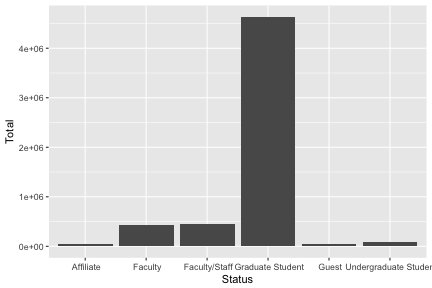
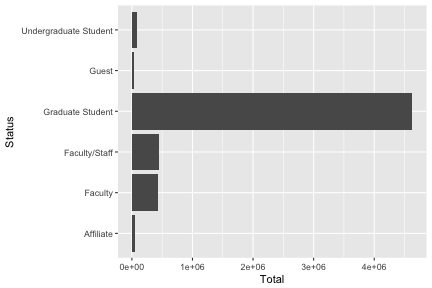
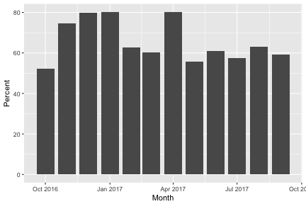
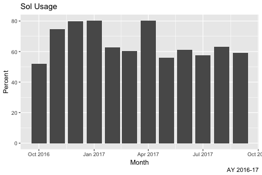
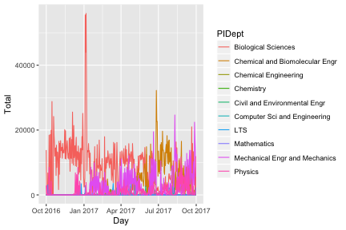
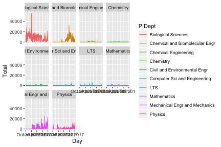
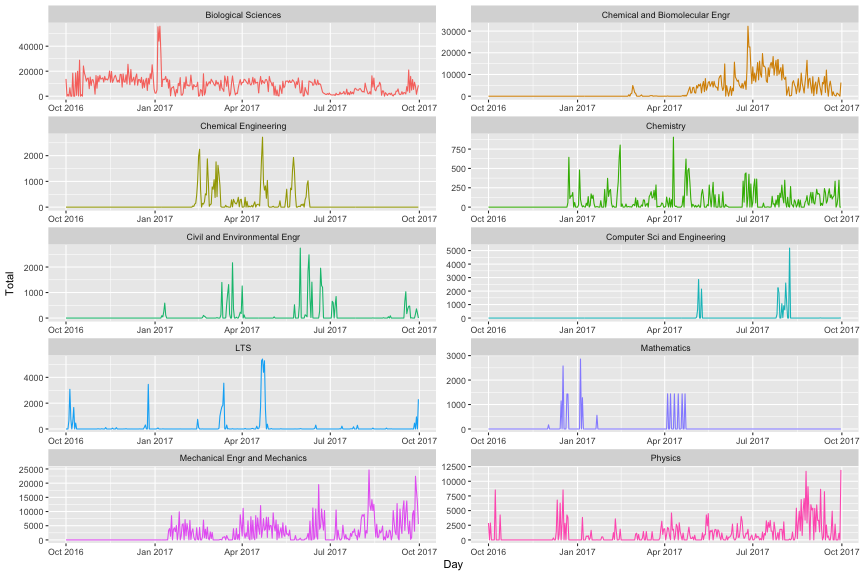
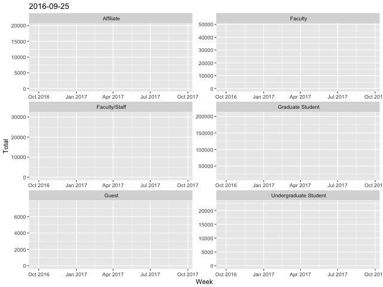

---
title       : Programming in R
subtitle    : A brief introduction
author      : Alex Pacheco
job         : LTS Research Computing
logo        : lu.png
framework   : io2012        # {io2012, html5slides, shower, dzslides, ...}
highlighter : highlight.js  # {highlight.js, prettify, highlight}
hitheme     : tomorrow      # 
widgets     : []            # {mathjax, quiz, bootstrap}
mode        : selfcontained # {standalone, draft}
knit        : slidify::knit2slides
license     : by-sa
--- .class

## History

* R is a dialect of the S language
    - S was initiated at the Bell Labs as an internal statistical analysis environment.
    - Most well known implementation is S‐plus (most recent stable release was in 2010)
* R was first announced in 1993.
* The R core group was formed in 1997, who controls the source code of R (written in C)
* R 1.0.0 was released in 2000
* The current version is 3.5.0 (released on April 23, 2018)
   * Previous version 3.4.4 was released on March 15, 2018

--- .class


## Features

- R is a dialect of the S language
    - Language designed for statistical analysis
    - Similar syntax
- Available on most platform/OS
- Rich data analysis functionalities and sophisticated graphical capabilities
- Active development and very active community
    - CRAN: The Comprehensive R Archive Network
- Source code and binaries, user contributed packages and documentation
    - More than 6,000 packages available on CRAN as of last week
- Free to use

--- .class

## Alternatives to R

* __S-PLUS__: commercial verison of S
* __Gretl__: open-source statistical package, mainly for econometrics
* __SPSS__: widely used program for statistical analysis in social science
* __PSPP__: free alternative to SPSS
* __SAS__: proprietary software that can be used with very large datasets such as census data
* __STATA__: proprietary software that is often used in economics and epidemiology
* __MATLAB__: proprietary software used widely in the mathematical sciences and engineering
* __GNU Octave__: free alternative to MATLAB
* __Python__: general programming language

--- .class 

## Installing R

* R can be installed on Windows, Mac OSX and Linux from [CRAN](https://cran.r-project.org/mirrors.html).
* R version 3.4.1 available as On Demand app on https://software.lehigh.edu


--- .class

## Running R

* From Command Line on *NIX
   - Enter `R` on the command line (if you have modified your `PATH` correctly)
* Batch Mode on *NIX
   - Use the `Rscript filename.R` command to execute commands from a file, `filename.R` 


```sh
cat hello.R
```

```
## print("Hello World!")
```


```sh
Rscript hello.R
```

```
## [1] "Hello World!"
```

--- .class

## RStudio

* [RStudio](https://www.rstudio.com/) is the most popular (de facto) environment for running R on all platforms.
* free and open source IDE for R. Can be installed on Windows, Mac OSX and Linux.
* user interface comparable to other IDEs or software such as MATLAB.
* more suited for development 
* Version 1.0.153 available as On Demand on https://software.lehigh.edu


--- .class

## Anaconda Python Distribution

 -  [Anaconda Python distribution](https://www.anaconda.com/distribution/) is the most popular platform for Python
 -  It provides 
     - a convenient install procedure for over 1400 Data Science libraries for Python and R
     - conda to manage your packages, dependencies, and environments
     - anaconda navigator: a desktop portal to install and launch applications and editors including Jupyter, RStudio, Visual Studio Code, and Spyder
         - install r-essentials from anaconda navigator or `conda install
           r-essentials` from the command line
 - Jupyter Notebooks is an alternative to RStudio for writing scripts and
   workflows that you can share with others. 
     - It is  ideal for reproducible research or data reporting
     
 - Visit https://go.lehigh.edu/linux to use R, Anaconda and other Linux software installed and maintained by the Research Computing group on your local Linux laptop or workstation


--- .class

## Get Started with R

* Use the console to use R as a simple calculator


```r
1 + 2
```

```
## [1] 3
```

* The assignment symbol is "<-". The classical "=" symbol can also be used


```r
a=2+3
b<-10/a
a
```

```
## [1] 5
```

```r
b
```

```
## [1] 2
```

--- .class

## Get Started with R

* install packages from CRAN, for e.g. knitr


```r
install.packages('knitr')
```

* load a library, for e.g. knitr


```r
library(knitr)
```

* Help from command line

```
?<command name>
??<part of command name/topic>
```

* or search in the help page in RStudio

* `getwd()`: display current working directory

* `setwd('dir')`: change current working director to `dir`

--- .class

## Data Classes

* R has five atomic classes
* Numeric
    - Double is equivalent to numeric.
    - Numbers in R are treated as numeric unless specified otherwise.
* Integer
* Complex
* Character
* Logical
    - TRUE or FALSE
* You can convert data from one type to the other using the `as.<Type>` functions
* To check the class of an object, use the `is.<Type>` function.

--- .class

## Example


```r
a <- 3
b <- sqrt(a)
b
```

```
## [1] 1.732051
```

```r
c <- 2i
d <- TRUE
d
```

```
## [1] TRUE
```

```r
as.numeric(d); as.character(b); is.complex(c)
```

```
## [1] 1
```

```
## [1] "1.73205080756888"
```

```
## [1] TRUE
```

--- .class


## Data Objects‐ Vectors

* Vectors can only contain elements of the same class
* Vectors can be constructed by
    -  Using the `c()` function (concatenate)
* Coercion will occur when mixed objects are passed to the `c()` function, as if the `as.<Type>()` function is explicitly called
    -  Using the `vector()` function
* One can use `[index]` to access individual element
    -  Indices start from 1


--- .class

## Examples


```r
# "#" indicates comment
# "<-" performs assignment operation (you can use "=" as well, but "<-" is preferred)
# numeric (double is the same as numeric)
d <- c(1,2,3)
# character
d <- c("1","2","3")
# you can covert at object with as.TYPE
# as. numeric changes the character vector created above to numeric
as.numeric(d)
```

```
## [1] 1 2 3
```

```r
# The conversion doesn't always work though
as.numeric("a")
```

```
## Warning: NAs introduced by coercion
```

```
## [1] NA
```

--- .class

## Examples (contd)


```r
x <- c(0.5, 0.6) ## numeric
x <- c(TRUE, FALSE) ## logical
x <- c(T, F) ## logical
x <- c("a", "b", "c") ## character
# The ":" operator can be used to generate integer sequences
x <- 9:29 ## integer
x <- c(1+0i, 2+4i) ## complex
x <- vector("numeric", length = 10)
# Coercion will occur when objects of different classes are mixed
y <- c(1.7, "a") ## character
y <- c(TRUE, 2) ## numeric
y <- c("a", TRUE) ## character
# Can also coerce explicitly
x <- 0:6
class(x)
```

```
## [1] "integer"
```

```r
as.logical(x)
```

```
## [1] FALSE  TRUE  TRUE  TRUE  TRUE  TRUE  TRUE
```

--- .class


## Vectorized Operations

* Lots of R operations process objects in a vectorized way
    -  more efficient, concise, and easier to read.


```r
x <- 1:4; y <- 6:9
x + y
```

```
## [1]  7  9 11 13
```

```r
x > 2
```

```
## [1] FALSE FALSE  TRUE  TRUE
```

```r
x * y
```

```
## [1]  6 14 24 36
```

```r
print( x[x >= 3] )
```

```
## [1] 3 4
```

--- .class


## Data Objects - Matrices

* Matrices are vectors with a dimension attribute
* R matrices can be constructed
    -  Using the `matrix()` function
	  - Passing an dim attribute to a vector
	  -  Using the `cbind()` or `rbind()` functions
* R matrices are constructed column‐wise
* One can use `[<index>,<index>]` to access individual element

--- .class


## Example

```r
# Create a matrix using the matrix() function
m <- matrix(1:6, nrow = 2, ncol = 3)
m
```

```
##      [,1] [,2] [,3]
## [1,]    1    3    5
## [2,]    2    4    6
```

```r
dim(m)
```

```
## [1] 2 3
```

```r
attributes(m)
```

```
## $dim
## [1] 2 3
```

--- .class

## Example


```r
# Pass a dim attribute to a vector
m <- 1:10
m
```

```
##  [1]  1  2  3  4  5  6  7  8  9 10
```

```r
dim(m) <- c(2, 5)
m
```

```
##      [,1] [,2] [,3] [,4] [,5]
## [1,]    1    3    5    7    9
## [2,]    2    4    6    8   10
```

--- .class

## Example


```r
# Row binding and column binding
x <- 1:3
y <- 10:12
cbind(x, y)
```

```
##      x  y
## [1,] 1 10
## [2,] 2 11
## [3,] 3 12
```

```r
rbind(x, y)
```

```
##   [,1] [,2] [,3]
## x    1    2    3
## y   10   11   12
```

--- .class

## Example


```r
# Slicing
m
```

```
##      [,1] [,2] [,3] [,4] [,5]
## [1,]    1    3    5    7    9
## [2,]    2    4    6    8   10
```

```r
# element at 2nd row, 3rd column
m[2,3]
```

```
## [1] 6
```

```r
# entire i<sup>th</sup> row of m
m[2,]
```

```
## [1]  2  4  6  8 10
```

```r
# entire j<sup>th</sup> column of m
m[,3]
```

```
## [1] 5 6
```

--- .class


## Data Objects - Lists

* Lists are a special kind of vector that contains objects of different classes
* Lists can be constructed by using the `list()` function
* Lists can be indexed using `[[  ]]`


```r
# Use the list() function to construct a list
x <- list(1, "a", TRUE, 1 + 4i)
x
```

```
## [[1]]
## [1] 1
## 
## [[2]]
## [1] "a"
## 
## [[3]]
## [1] TRUE
## 
## [[4]]
## [1] 1+4i
```

--- .class


## Data Objects - Data Frames
* Data frames are used to store tabular data
    -  They are a special type of list where every element of the list has to have the same length
    -  Each element of the list can be thought of as a column
    -  Data frames can store different classes of objects in each column
    -  Data frames also have a special attribute called `row.names`
    -  Data frames are usually created by calling `read.table()` or `read.csv()`
          -  More on this later
    -  Can be converted to a matrix by calling `data.matrix()`

--- .class


## Names

* R objects can have names


```r
# Each element in a vector can have a name
x <- 1:3
names(x)
```

```
## NULL
```

```r
names(x) <- c("a","b","c")
names(x)
```

```
## [1] "a" "b" "c"
```

```r
x
```

```
## a b c 
## 1 2 3
```

--- .class

## Names (contd)


```r
# Lists
x <- list(a = 1, b = 2, c = 3)
x
```

```
## $a
## [1] 1
## 
## $b
## [1] 2
## 
## $c
## [1] 3
```

```r
# Names can be used to refer to individual element
x$a
```

```
## [1] 1
```

--- .class

## Names (contd)


```r
# Columns and rows of matrices
m <- matrix(1:4, nrow = 2, ncol = 2)
dimnames(m) <- list(c("a", "b"), c("c", "d"))
m
```

```
##   c d
## a 1 3
## b 2 4
```

--- .class


## Querying Object Attributes

* The `class()` function
* The `str()` function
* The `attributes()` function reveals attributes of an object (does not work with vectors)
    -  Class
    -  Names
    -  Dimensions
    -  Length
    -  User defined attributes
* They work on all objects (including functions)

--- .class

## Example


```r
m <- matrix(1:10, nrow = 2, ncol = 5)
str(matrix)
```

```
## function (data = NA, nrow = 1, ncol = 1, byrow = FALSE, dimnames = NULL)
```

```r
str(m)
```

```
##  int [1:2, 1:5] 1 2 3 4 5 6 7 8 9 10
```

```r
str(str)
```

```
## function (object, ...)
```

--- .class


## Data Class - Factors

* Factors are used to represent categorical data.
* Factors can be unordered or ordered.
* Factors are treated specially by modelling functions like `lm()` and `glm()`


```r
# Use the factor() function to construct a vector of factors
# The order of levels can be set by the levels keyword
x <- factor(c("yes", "yes", "no", "yes", "no"), levels = c("yes", "no"))
x
```

```
## [1] yes yes no  yes no 
## Levels: yes no
```

--- .class


## Date and Time

* R has a Date class for date data while times are represented by POSIX formats
* One can convert a text string to date using the `as.Date()` function
* The `strptime()` function can deal with dates and times in different formats.
* The package "`lubridate`" provides many additional and convenient features


```r
# Dates are stored internally as the number of days since 1970-01-01
x <- as.Date("1970-01-01")
x
```

```
## [1] "1970-01-01"
```

```r
as.numeric(x)
```

```
## [1] 0
```

```r
x+1
```

```
## [1] "1970-01-02"
```

--- .class

## Data and Time (contd)


```r
# Times are stored internally as the number of seconds since 1970-01-01
x <- Sys.time() ; x
```

```
## [1] "2018-06-29 11:25:40 EDT"
```

```r
as.numeric(x)
```

```
## [1] 1530285941
```

```r
p <- as.POSIXlt(x)
names(unclass(p))
```

```
##  [1] "sec"    "min"    "hour"   "mday"   "mon"    "year"   "wday"  
##  [8] "yday"   "isdst"  "zone"   "gmtoff"
```

```r
p$sec
```

```
## [1] 40.52537
```

--- .class


## Missing Values

* Missing values are denoted by `NA` or `NaN` for undefined mathematical operations.
    - `is.na()` is used to test objects if they are `NA`
    - `is.nan()` is used to test for `NaN`
    - `NA` values have a class also, so there are integer `NA`, character `NA`, etc.
    - A `NaN` value is also `NA` but the converse is not true


```r
x <- c(1,2, NA, 10,3)
is.na(x)
```

```
## [1] FALSE FALSE  TRUE FALSE FALSE
```

```r
is.nan(x)
```

```
## [1] FALSE FALSE FALSE FALSE FALSE
```

--- .class

## Missing Values (contd)


```r
x <- c(1,2, NaN, NA,4)
is.na(x)
```

```
## [1] FALSE FALSE  TRUE  TRUE FALSE
```

```r
is.nan(x)
```

```
## [1] FALSE FALSE  TRUE FALSE FALSE
```

--- .class

## Arithmetic Functions

<table>
<tr><th>Function</th><th>Description</th></tr>   
<tr><td><code>exp()</code></td><td>     Exponentiation</td></tr>
<tr><td><code>log()</code></td><td>     Natural Logarithm</td></tr>
<tr><td><code>log10()</code></td><td>   Logarithm to base 10</td></tr>
<tr><td><code>sqrt()</code></td><td>    square root</td></tr>
<tr><td><code>abs()</code></td><td>     absolute value</td></tr>
<tr><td><code>sin()</code></td><td>     sine</td></tr>
<tr><td><code>cos()</code></td><td>     cosine</td></tr>
<tr><td><code>floor()</code></td><td>    </td></tr>
<tr><td><code>ceiling()</code></td><td> rounding of numbers</td></tr>
<tr><td><code>round()</code></td><td>   </td></tr>
</table>

--- .class

## Simple Statistic Functions

<table border="1">
<tr><th>Function</th><th>Description</th></tr>
<tr><td><code>min()</code></td><td>minimum value</td></tr>
<tr><td><code>max()</code></td><td>maximum value</td></tr>
<tr><td><code>which.min()</code></td><td>location of minimum</td></tr>
<tr><td><code>which.max()</code></td><td>location of maximum</td></tr>
<tr><td><code>pmin()</code></td><td>elementwise minima of several vectors</td></tr>
<tr><td><code>pmax()</code></td><td>elementwise maxima of several vectors</td></tr>
<tr><td><code>sum()</code></td><td>sum of elements of a vector</td></tr>
<tr><td><code>mean()</code></td><td>mean of elements of a vector</td></tr>
<tr><td><code>prod()</code></td><td>products of elements of a vector</td></tr>
</table>

--- .class


## Distributions and Random Variables

* For each distribution R provides four functions: density (`d`), cumulative density (`p`), quantile (`q`), and random generation (`r`)
    - The function name is of the form `[d|p|q|r]<name of distribution>`
    - e.g. `qbinom()` gives the quantile of a binomial distribution


<table>
<tr><th>Distribution</th><th>Distribution name in R</th></tr>
<tr><td>Uniform</td><td><code>unif</code></td></tr>
<tr><td>Binomial</td><td><code>binom</code></td></tr>
<tr><td>Poisson</td><td><code>pois</code></td></tr>
<tr><td>Geometric</td><td><code>geom</code></td></tr>
<tr><td>Gamma</td><td><code>gamma</code></td></tr>
<tr><td>Normal</td><td><code>norm</code></td></tr>
<tr><td>Log Normal</td><td><code>lnorm</code></td></tr>
<tr><td>Exponential</td><td><code>exp</code></td></tr>
<tr><td>Student’s t</td><td><code>t</code></td></tr>
</table>

--- .class

## Examples: Distributions and Random Variables


```r
# Random generation from a uniform distribution.
runif(10, 2, 4)
```

```
##  [1] 2.946829 2.053148 3.281469 2.666085 3.779892 3.168088 3.753148
##  [8] 2.046016 2.848918 2.767700
```

```r
# You can name the arguments in the function call.
runif(10, min = 2, max = 4)
```

```
##  [1] 3.720911 3.274748 2.354746 3.823084 2.790421 2.820554 3.489590
##  [8] 3.600850 2.936109 2.065265
```

```r
# Given p value and degree of freedom, find the t-value.
qt(p=0.975, df = 8)
```

```
## [1] 2.306004
```

```r
# The inverse of the above function call
pt(2.306, df = 8)
```

```
## [1] 0.9749998
```

--- .class

## User Defined Functions
* Similar to other languages, functions in R are defined by using the `function()` directives
* The return value is the last expression in the function body to be evaluated.
* Functions can be nested
* Functions are R objects
    - For example, they can be passed as an argument to other functions


```r
newDef <- function(a,b)
 {
     x = runif(10,a,b)
     mean(x)
 }
newDef(-1,1)
```

```
## [1] 0.07219243
```

--- .class

## Control Structures
* Control structures allow one to control the flow of execution.

<table>
<tr><td><code>if … else</code></td><td>testing a condition</td></tr>
<tr><td><code>for</code></td><td>executing a loop (with fixed number of iterations)</td></tr>
<tr><td><code>while</code></td><td>executing a loop when a condition is true</td></tr>
<tr><td><code>repeat</code></td><td>executing an infinite loop</td></tr>
<tr><td><code>break</code></td><td>breaking the execution of a loop</td></tr>
<tr><td><code>next</code></td><td>skipping to next iteration</td></tr>
<tr><td><code>return</code></td><td>exit a function</td></tr>
</table>

--- .class


## Testing conditions


```r
# Comparisons: <,<=,>,>=,==,!=
# Logical operations: !, &&, ||
if(x > 3 && x < 5) {
  print ("x is between 3 and 5")
} else if(x <= 3) {
  print ("x is less or equal to 3")
} else {
  print ("x is greater or equal to 5")
}
```

--- .class

## For Loops


```r
x <- c("a", "b", "c", "d")
# These loops have the same effect
# Loop through the indices
for(i in 1:4) {
  print(x[i])
}
```

```
## [1] "a"
## [1] "b"
## [1] "c"
## [1] "d"
```

```r
# Loop using the seq_along() function
for(i in seq_along(x)) {
  print(x[i])
}
```

```
## [1] "a"
## [1] "b"
## [1] "c"
## [1] "d"
```

--- .class

## For Loops (contd)


```r
# Loop through the name
for(letter in x) {
  print(letter)
}
```

```
## [1] "a"
## [1] "b"
## [1] "c"
## [1] "d"
```

```r
for(i in 1:4) print(x[i])
```

```
## [1] "a"
## [1] "b"
## [1] "c"
## [1] "d"
```

--- .class &twocol

## while loops

* The `while` loop can be used to repeat a set of instructions
* It is often used when you do not know in advance how often the instructions will be executed. 
* The basic format for a `while` loop is `while(cond) expr`

*** =left


```r
sum <- 1
while ( sum < 11 )
{
  sum <- sum + 2;
  print(sum);
}
```

```
## [1] 3
## [1] 5
## [1] 7
## [1] 9
## [1] 11
```

*** =right


```r
sum <- 12
while (sum < 11 ) 
{
  sum <- sum + 2;
  print(sum);
}
```

--- .class &twocol

## repeat loops

* The `repeat` loop is similar to the `while` loop. 
* The difference is that it will always begin the loop the first time. The `while` loop will only start the loop if the condition is true the first time it is evaluated. 
* Another difference is that you have to explicitly specify when to stop the loop using the `break` command.

*** =left


```r
sum <- 1
repeat
{
  sum <- sum + 2;
  print(sum);
  if (sum > 11)
    break;
}
```

```
## [1] 3
## [1] 5
## [1] 7
## [1] 9
## [1] 11
## [1] 13
```

*** =right


```r
sum <- 12
repeat
{
  sum <- sum + 2;
  print(sum);
  if (sum > 11)
    break;
}
```

```
## [1] 14
```

--- .class

## break and next statements

* The `break` statement is used to stop the execution of the current loop. 
  - It will break out of the current loop. 
* The `next` statement is used to skip the statements that follow and restart the current loop. 
  - If a `for` loop is used then the `next` statement will update the loop variable.


```r
x <- rnorm(5)
for(lupe in x)
 {
     if (lupe > 2.0)
         next

     if( (lupe<0.6) && (lupe > 0.5))
        break

    cat("The value of lupe is ",lupe,"\n");
 }
```

```
## The value of lupe is  -0.2217048 
## The value of lupe is  -0.4944799 
## The value of lupe is  0.03718532 
## The value of lupe is  1.464075 
## The value of lupe is  -0.9449242
```


--- .class

## The apply Function
* The `apply()` function evaluate a function over
the margins of an array
    - More concise than the for loops (not necessarily
faster)


```r
# X: array objects
# MARGIN: a vector giving the subscripts which the function will be applied over
# FUN: a function to be applied
str(apply)
```

```
## function (X, MARGIN, FUN, ...)
```

```r
x <- matrix(rnorm(200), 20, 10)
# Row means
apply(x, 1, mean)
```

```
##  [1] -0.002733676  0.255706591 -0.334535585  0.193940509 -0.167061199
##  [6]  0.047727607  0.236020377 -0.105258858 -0.155520308 -0.172524330
## [11] -0.131223502 -0.368198816  0.706120784 -0.154825446 -0.013222187
## [16]  0.264050513  0.621216362  0.102037745  0.231081023 -0.038677980
```

--- .class

## The apply Function (contd)


```r
# Column sums
apply(x, 2, sum)
```

```
##  [1] -1.9337308 -1.6049389  0.0735518  8.0626229  1.2770681  5.8765643
##  [7] -3.0444718 -0.4699520  2.4214846 -0.5170018
```

```r
# 25th and 75th Quantiles for rows
apply(x, 1, quantile, probs = c(0.25, 0.75))
```

```
##            [,1]       [,2]       [,3]       [,4]       [,5]       [,6]
## 25% -0.55479024 -0.7255746 -0.6548144 -0.4577558 -0.4680271 -0.9145968
## 75%  0.02138132  0.9858115 -0.3272142  0.8416130  0.2517897  1.0347282
##           [,7]       [,8]       [,9]      [,10]      [,11]      [,12]
## 25% -0.2447043 -0.4733757 -0.8950189 -1.2338269 -0.4337933 -0.8880318
## 75%  0.5818426  0.3292204  0.5637068  0.6231946  0.4965920  0.2171644
##         [,13]      [,14]      [,15]      [,16]     [,17]      [,18]
## 25% 0.2313612 -0.8834574 -0.2845922 -0.5036784 0.3588535 -0.5292270
## 75% 1.0017192  0.3723524  0.5620739  1.1612216 0.9497598  0.7860163
##          [,19]      [,20]
## 25% -0.4947079 -0.7581874
## 75%  1.0709185  0.6902507
```

--- .class

## The apply Function (contd)


```r
dim(x)
```

```
## [1] 20 10
```

```r
# Change the dimensions of x
dim(x) <- c(2,2,50)
# Take average over the first two dimensions
apply(x, c(1, 2), mean)
```

```
##            [,1]         [,2]
## [1,] 0.20040439 -0.002375975
## [2,] 0.01562443 -0.010828926
```

```r
rowMeans(x, dims = 2)
```

```
##            [,1]         [,2]
## [1,] 0.20040439 -0.002375975
## [2,] 0.01562443 -0.010828926
```

--- .class

## Other Apply Functions
* `lapply`: Loop over a list and evaluate a function on each element
* `sapply`: Same as lapply but try to simplify the result
* `tapply`: Apply a function over subsets of a vector
* `mapply`: Multivariate version of lapply

--- .class

## R for Data Science

* The `tidyverse` is a collection of R packages developed by RStudio’s chief scientist Hadley Wickham. 
     * `ggplot2` for data visualisation.
     * `dplyr` for data manipulation.
     * `tidyr` for data tidying.
     * `readr` for data import.
     * `purrr` for functional programming.
     * `tibble` for tibbles, a modern re-imagining of data frames.
* These packages work well together as part of larger data analysis pipeline. 
* To learn more about these tools and how they work together, read [R for Data Science](http://r4ds.had.co.nz/). 

--- .class

## Tidyverse

* What is Tidy Data?
     * "Tidy data" is a term that describes a standardized approach to structuring datasets to make analyses and visualizations easier. 
* The core tidy data principles
     * Variable make up the columns
     * Observations make up the rows
     * Values go into cells
* `library(tidyverse)` will load the core tidyverse packages:


```r
library(tidyverse)
```

```
## ── Attaching packages ───────────────────────────────────────────────────────────────────────── tidyverse 1.2.1 ──
```

```
## ✔ ggplot2 2.2.1     ✔ purrr   0.2.4
## ✔ tibble  1.4.2     ✔ dplyr   0.7.4
## ✔ tidyr   0.7.2     ✔ stringr 1.3.0
## ✔ readr   1.1.1     ✔ forcats 0.2.0
```

```
## ── Conflicts ──────────────────────────────────────────────────────────────────────────── tidyverse_conflicts() ──
## ✖ dplyr::filter() masks stats::filter()
## ✖ dplyr::lag()    masks stats::lag()
```

```r
library(lubridate)
```

```
## 
## Attaching package: 'lubridate'
```

```
## The following object is masked from 'package:base':
## 
##     date
```

--- .class

## Tidyverse 

* Packages that are part of tidyverse but not loaded automatically
   * `lubridate` for dates and date-times
   * `magrittr` provides the pipe, %>% used throughout the tidyverse.
   * `readxl` for .xls and .xlsx sheets.
   * `haven` for SPSS, Stata, and SAS data. 
* packages that are not in the tidyverse, but are tidyverse-adjacent. They are very useful for importing data from other sources:
   * `jsonlite` for JSON.
   * `xml2` for XML.
   * `httr` for web APIs.
   * `rvest` for web scraping.
   * `DBI` for relational databases

--- .class

## Readr Package

* `readr` is to provide a fast and friendly way to read rectangular data (like csv, tsv, and fwf).
* `readr` supports seven file formats with seven read_ functions:
    * `read_csv()`: comma separated (CSV) files
    * `read_csv2()`: semicolon separated file and "," for decimal point
    * `read_tsv()`: tab separated files
    * `read_delim()`: general delimited files
    * `read_fwf()`: fixed width files
    * `read_table()`: tabular files where colums are separated by white-space.
    * `read_log()`: web log files
* Usage
    * `read_delim(file,delim)` 
          - `file`: path to a file, a connection, or literal data

--- .class

## Example


```r
# read daily usage report for Sol in AY 2016-17
# usage is reported in terms of SUs used and jobs submitted for
#  serial (1 cpu), single or smp ( > 1 cpu but max of 1 node) and 
#  parallel or multi node (> 1 node)  jobs 
daily <- read_delim('http://webapps.lehigh.edu/hpc/training/soldaily1617-public.csv',delim=";")
```

```
## Parsed with column specification:
## cols(
##   Type = col_character(),
##   Name = col_character(),
##   Department = col_character(),
##   PI = col_character(),
##   PIDept = col_character(),
##   Status = col_character(),
##   Day = col_date(format = ""),
##   SerialJ = col_character(),
##   Serial = col_character(),
##   SingleJ = col_character(),
##   Single = col_character(),
##   MultiJ = col_character(),
##   Multi = col_character(),
##   TotalJ = col_character(),
##   Total = col_character()
## )
```

* the `readr` functions will just work: you supply the path to a file and you get a `tibble` back

--- .class

## Tibble

* A `tibble`, or `tbl_df`, is a modern reimagining of the data.frame, 
   * keeping what time has proven to be effective, and 
   * throwing out what is not. 
* Tibbles are data.frames that are lazy and surly 

* Create a tibble from an existing object with `as_tibble()`
* create a new tibble from column vectors with `tibble()`


```r
tibble(x = 1:5, y = 1, z = x ^ 2 + y)
```

```
## # A tibble: 5 x 3
##       x     y     z
##   <int> <dbl> <dbl>
## 1     1    1.    2.
## 2     2    1.    5.
## 3     3    1.   10.
## 4     4    1.   17.
## 5     5    1.   26.
```


--- .class

## Tibble (contd)

* define a tibble row-by-row with `tribble()`:


```r
tribble(
  ~x, ~y,  ~z,
  "a", 2,  3.6,
  "b", 1,  8.5
)
```

```
## # A tibble: 2 x 3
##   x         y     z
##   <chr> <dbl> <dbl>
## 1 a        2.  3.60
## 2 b        1.  8.50
```

--- .class

## Dplyr

* `dplyr` is a grammar of data manipulation, providing a consistent set of verbs to  solve the most common data manipulation challenges:
  * `mutate()` adds new variables that are functions of existing variables
  * `select()` picks variables based on their names.
  * `filter()` picks cases based on their values.
  * `summarise()` reduces multiple values down to a single summary.
  * `arrange()` changes the ordering of the rows.
* These all combine naturally with `group_by()` which allows you to perform any operation "by group"


--- .class

## Example


```r
daily %>% head
```

```
## # A tibble: 6 x 15
##   Type  Name   Department   PI    PIDept  Status Day        SerialJ Serial
##   <chr> <chr>  <chr>        <chr> <chr>   <chr>  <date>     <chr>   <chr> 
## 1 User  " use… " Mechanica… " pi… " Mech… " Gra… 2016-10-01 " 0"    " 0.0…
## 2 User  " use… " EN/Mechan… " pi… " Mech… " Gra… 2016-10-01 " 0"    " 0.0…
## 3 User  " use… " EN/Mechan… " pi… " Mech… " Gra… 2016-10-01 " 0"    " 0.0…
## 4 User  " use… " EN/Mechan… " pi… " Mech… " Gra… 2016-10-01 " 0"    " 0.0…
## 5 User  " use… " EN/"       " pi… " Mech… " Gra… 2016-10-01 " 0"    " 0.0…
## 6 User  " use… " EN/Mechan… " pi… " Mech… " Gra… 2016-10-01 " 0"    " 0.0…
## # ... with 6 more variables: SingleJ <chr>, Single <chr>, MultiJ <chr>,
## #   Multi <chr>, TotalJ <chr>, Total <chr>
```

```r
# Number of core hours available per month for AY 2016-17
# Oct 1, 2016: Initial launch with 780 cpu
# Mar 15, 2017: Added 192 cpus
# May 1, 2017: Added 312 cpus
# Total Available at end of AY 2016-17: 1284 cpus
ay1617su <- c(580320.00,561600.00,580320.00,580320.00,524160.00,580320.00,699840.00,955296.00,924480.00,955296.00,955296.00,924480.00)
```


--- .class

## Example


```r
monthly <- daily %>% 
  group_by(Month=floor_date(as.Date(Day), "month"),Name,Department,PI,PIDept,Status) %>% 
  summarize(Serial=sum(as.double(Serial)),
    Single=sum(as.double(Single)),
    Multi=sum(as.double(Multi)),
    Total=sum(as.double(Total)),
    SerialJ=sum(as.double(SerialJ)),
    SingleJ=sum(as.double(SingleJ)),
    MultiJ=sum(as.double(MultiJ)),
    TotalJ=sum(as.double(TotalJ)))
monthly %>% head
```

```
## # A tibble: 6 x 14
## # Groups:   Month, Name, Department, PI, PIDept [6]
##   Month      Name   Department   PI     PIDept  Status Serial Single Multi
##   <date>     <chr>  <chr>        <chr>  <chr>   <chr>   <dbl>  <dbl> <dbl>
## 1 2016-10-01 " use… " Mechanica… " pi0… " Mech… " Gra…     0.     0.    0.
## 2 2016-10-01 " use… " EN/Mechan… " pi0… " Mech… " Gra…     0.     0.    0.
## 3 2016-10-01 " use… " EN/Mechan… " pi0… " Mech… " Gra…     0.     0.    0.
## 4 2016-10-01 " use… " EN/Mechan… " pi0… " Mech… " Gra…     0.     0.    0.
## 5 2016-10-01 " use… " EN/"       " pi0… " Mech… " Gra…     0.     0.    0.
## 6 2016-10-01 " use… " EN/Mechan… " pi0… " Mech… " Gra…     0.     0.    0.
## # ... with 5 more variables: Total <dbl>, SerialJ <dbl>, SingleJ <dbl>,
## #   MultiJ <dbl>, TotalJ <dbl>
```

--- .class

## Sol usage per month


```r
monthly %>% 
  group_by(Month) %>%	
  summarize(Total=round(sum(as.double(Total)),2),Jobs=round(sum(as.double(TotalJ)))) %>%
  mutate(Available=ay1617su,Unused=Available-Total,Percent=round(Total/Available*100,2)) -> monthlyusage
monthlyusage
```

```
## # A tibble: 12 x 6
##    Month        Total   Jobs Available  Unused Percent
##    <date>       <dbl>  <dbl>     <dbl>   <dbl>   <dbl>
##  1 2016-10-01 302612.   582.   580320. 277708.    52.2
##  2 2016-11-01 419350. 24078.   561600. 142250.    74.7
##  3 2016-12-01 463780. 21407.   580320. 116540.    79.9
##  4 2017-01-01 465491.  7016.   580320. 114829.    80.2
##  5 2017-02-01 328076. 11031.   524160. 196084.    62.6
##  6 2017-03-01 349473. 11279.   580320. 230847.    60.2
##  7 2017-04-01 560704.  6348.   699840. 139136.    80.1
##  8 2017-05-01 533431. 21873.   955296. 421865.    55.8
##  9 2017-06-01 564697.  5604.   924480. 359783.    61.1
## 10 2017-07-01 549729. 20013.   955296. 405567.    57.6
## 11 2017-08-01 602890. 45945.   955296. 352406.    63.1
## 12 2017-09-01 548241. 31121.   924480. 376239.    59.3
```

--- .class

## Sol usage per PI's Department


```r
library(knitr)
monthly %>%
  group_by(PIDept) %>%
  summarize(Total=round(sum(as.double(Total)),2),Jobs=round(sum(as.double(TotalJ)))) %>%
  kable
```


|PIDept                         |      Total|   Jobs|
|:------------------------------|----------:|------:|
|Biological Sciences            | 3178662.32| 188074|
|Chemical and Biomolecular Engr | 1075569.60|   4546|
|Chemical Engineering           |   44747.30|   3424|
|Chemistry                      |   24950.47|   1192|
|Civil and Environmental Engr   |   32294.69|   1330|
|Computer Sci and Engineering   |   21673.44|    476|
|LTS                            |   52167.27|   2824|
|Mathematics                    |   20104.04|     35|
|Mechanical Engr and Mechanics  |  871391.19|   3495|
|Physics                        |  366912.48|    901|

--- .class

## Sol usage by user's department or major


```r
monthly %>%
  group_by(Department) %>%
  summarize(Serial=round(sum(as.double(Serial))),SMP=round(sum(as.double(Single))),DMP=round(sum(as.double(Multi))),Total=round(sum(as.double(Total)),2),Jobs=round(sum(as.double(TotalJ)))) %>%
  arrange(desc(Total)) %>%
  kable
```


|Department                        | Serial|    SMP|     DMP|      Total|  Jobs|
|:---------------------------------|------:|------:|-------:|----------:|-----:|
|AS/Biochemistry (CAS)             | 225602| 365083| 2077618| 2668302.97| 76112|
|EN/Chemical Engineering           |  20748| 346296|  286186|  653229.90|  5340|
|EN/Mechanical Engineering         |      0| 321597|  300579|  622176.07|  2457|
|Biological Sciences               | 172290|  73569|  209243|  455101.83| 86879|
|Chemical and Biomolecular Engr    |   2663| 272962|  175245|  450870.03|  1487|
|AS/Physics (AS)                   |    340| 159440|  210693|  370473.39|  1025|
|EN/                               |   4285|  41891|  114646|  160821.65|   624|
|Mechanical Engr and Mechanics     |     61|  16614|   79776|   96451.62|   869|
|LTS                               |    325|   9051|   42415|   51790.48|  2732|
|Civil and Environmental Engr      |    161|  32134|       0|   32294.69|  1330|
|Chemistry                         |      0|  24950|       0|   24950.47|  1192|
|Mathematics                       |      0|  20104|       0|   20104.04|    35|
|IC/Computer Science & Business    |      0|   7506|   11559|   19065.68|   195|
|Computer Sci and Engineering      |  10759|   7725|       0|   18483.86| 24550|
|AS/Behavioral Neuroscience        |      0|  15132|    2087|   17219.65|   426|
|EN/Computer Science (EN)          |     13|  15921|       0|   15934.02|   395|
|EN/Bioengineering                 |      0|   2032|    6512|    8544.27|    25|
|Chemical Engineering              |      0|   2170|       0|    2170.35|   359|
|AS/Chemistry (AS)                 |      0|    345|     137|     482.21|   239|
|EN/Computer Engineering           |      5|      0|       0|       5.44|    16|
|EN/Structural Engineering         |      0|      0|       0|       0.17|     2|
|AS/Applied Mathematics            |      0|      0|       0|       0.00|     1|
|AS/Economics                      |      0|      0|       0|       0.00|     0|
|AS/Mathematics                    |      0|      0|       0|       0.00|     7|
|AS/Molecular Biology              |      0|      0|       0|       0.00|     0|
|AS/Undeclared                     |      0|      0|       0|       0.00|     0|
|EN/Electrical Engineering         |      0|      0|       0|       0.00|     0|
|EN/Healthcare Systems Engineering |      0|      0|       0|       0.00|     0|
|Engineering Rsch Ctr - ATLSS      |      0|      0|       0|       0.00|     0|
|IC/Bioengineering                 |      0|      0|       0|       0.00|     0|
|Industrial and Syst Engr          |      0|      0|       0|       0.00|     0|
|LTS Technology Infrastructure     |      0|      0|       0|       0.00|     0|
|Physics                           |      0|      0|       0|       0.00|     0|
|Provost Office                    |      0|      0|       0|       0.00|     0|


--- .class

## Need code for creating LaTeX documents


```r
library(xtable)
monthly %>%
  group_by(Department) %>%
  summarize(Serial=round(sum(as.double(Serial))),SMP=round(sum(as.double(Single))),DMP=round(sum(as.double(Multi))),Total=round(sum(as.double(Total)),2),Jobs=round(sum(as.double(TotalJ)))) %>%
  arrange(desc(Total)) %>%
  xtable
```

```
## % latex table generated in R 3.4.3 by xtable 1.8-2 package
## % Fri Jun 29 11:25:45 2018
## \begin{table}[ht]
## \centering
## \begin{tabular}{rlrrrrr}
##   \hline
##  & Department & Serial & SMP & DMP & Total & Jobs \\ 
##   \hline
## 1 &  AS/Biochemistry (CAS) & 225602.00 & 365083.00 & 2077618.00 & 2668302.97 & 76112.00 \\ 
##   2 &  EN/Chemical Engineering & 20748.00 & 346296.00 & 286186.00 & 653229.90 & 5340.00 \\ 
##   3 &  EN/Mechanical Engineering & 0.00 & 321597.00 & 300579.00 & 622176.07 & 2457.00 \\ 
##   4 &  Biological Sciences & 172290.00 & 73569.00 & 209243.00 & 455101.83 & 86879.00 \\ 
##   5 &  Chemical and Biomolecular Engr & 2663.00 & 272962.00 & 175245.00 & 450870.03 & 1487.00 \\ 
##   6 &  AS/Physics (AS) & 340.00 & 159440.00 & 210693.00 & 370473.39 & 1025.00 \\ 
##   7 &  EN/ & 4285.00 & 41891.00 & 114646.00 & 160821.65 & 624.00 \\ 
##   8 &  Mechanical Engr and Mechanics & 61.00 & 16614.00 & 79776.00 & 96451.62 & 869.00 \\ 
##   9 &  LTS & 325.00 & 9051.00 & 42415.00 & 51790.48 & 2732.00 \\ 
##   10 &  Civil and Environmental Engr & 161.00 & 32134.00 & 0.00 & 32294.69 & 1330.00 \\ 
##   11 &  Chemistry & 0.00 & 24950.00 & 0.00 & 24950.47 & 1192.00 \\ 
##   12 &  Mathematics & 0.00 & 20104.00 & 0.00 & 20104.04 & 35.00 \\ 
##   13 &  IC/Computer Science \& Business & 0.00 & 7506.00 & 11559.00 & 19065.68 & 195.00 \\ 
##   14 &  Computer Sci and Engineering & 10759.00 & 7725.00 & 0.00 & 18483.86 & 24550.00 \\ 
##   15 &  AS/Behavioral Neuroscience & 0.00 & 15132.00 & 2087.00 & 17219.65 & 426.00 \\ 
##   16 &  EN/Computer Science (EN) & 13.00 & 15921.00 & 0.00 & 15934.02 & 395.00 \\ 
##   17 &  EN/Bioengineering & 0.00 & 2032.00 & 6512.00 & 8544.27 & 25.00 \\ 
##   18 &  Chemical Engineering & 0.00 & 2170.00 & 0.00 & 2170.35 & 359.00 \\ 
##   19 &  AS/Chemistry (AS) & 0.00 & 345.00 & 137.00 & 482.21 & 239.00 \\ 
##   20 &  EN/Computer Engineering & 5.00 & 0.00 & 0.00 & 5.44 & 16.00 \\ 
##   21 &  EN/Structural Engineering & 0.00 & 0.00 & 0.00 & 0.17 & 2.00 \\ 
##   22 &  AS/Applied Mathematics & 0.00 & 0.00 & 0.00 & 0.00 & 1.00 \\ 
##   23 &  AS/Economics & 0.00 & 0.00 & 0.00 & 0.00 & 0.00 \\ 
##   24 &  AS/Mathematics & 0.00 & 0.00 & 0.00 & 0.00 & 7.00 \\ 
##   25 &  AS/Molecular Biology & 0.00 & 0.00 & 0.00 & 0.00 & 0.00 \\ 
##   26 &  AS/Undeclared & 0.00 & 0.00 & 0.00 & 0.00 & 0.00 \\ 
##   27 &  EN/Electrical Engineering & 0.00 & 0.00 & 0.00 & 0.00 & 0.00 \\ 
##   28 &  EN/Healthcare Systems Engineering & 0.00 & 0.00 & 0.00 & 0.00 & 0.00 \\ 
##   29 &  Engineering Rsch Ctr - ATLSS & 0.00 & 0.00 & 0.00 & 0.00 & 0.00 \\ 
##   30 &  IC/Bioengineering & 0.00 & 0.00 & 0.00 & 0.00 & 0.00 \\ 
##   31 &  Industrial and Syst Engr & 0.00 & 0.00 & 0.00 & 0.00 & 0.00 \\ 
##   32 &  LTS Technology Infrastructure & 0.00 & 0.00 & 0.00 & 0.00 & 0.00 \\ 
##   33 &  Physics & 0.00 & 0.00 & 0.00 & 0.00 & 0.00 \\ 
##   34 &  Provost Office & 0.00 & 0.00 & 0.00 & 0.00 & 0.00 \\ 
##    \hline
## \end{tabular}
## \end{table}
```

--- .class

## Sol usage by user affiliation


```r
monthly %>%
  group_by(Status) %>%
  summarize(Total=round(sum(as.double(Total)),2)) -> monthlystatus
monthlystatus
```

```
## # A tibble: 6 x 2
##   Status                      Total
##   <chr>                       <dbl>
## 1 " Affiliate"               49513.
## 2 " Faculty"                436898.
## 3 " Faculty/Staff"          441351.
## 4 " Graduate Student"      4631676.
## 5 " Guest"                   40979.
## 6 " Undergraduate Student"   88055.
```


--- .class

## Tidyr

* The goal of `tidyr` is to help you create tidy data.
* Tidy data is data where:
   * Each variable is in a column.
   * Each observation is a row.
   * Each value is a cell.
* Tidy data describes a standard way of storing data that is used wherever
 possible throughout the `tidyverse`. 
* If you ensure that your data is tidy, you’ll spend less timing fighting with the tools and more time working on your analysis.

* two fundamental verbs of data tidying:
   * `gather()` takes multiple columns, and gathers them into key-value pairs
   * `spread()`. takes two columns (key & value) and spreads in to multiple columns


--- .class

## Example


```r
daily %>% 
  filter(as.Date(Day) >= "2017-02-01" & as.Date(Day) <= "2017-03-01") %>% 
  select(Day,Name,Department,PI,PIDept,Serial,Single,Multi) %>% 
  gather(JobType,Usage,Serial:Multi) %>% 
  filter(as.double(Usage) > 100 ) -> tmp
tmp %>% arrange(Usage) %>% 
  kable
```


|Day        |Name    |Department                     |PI    |PIDept                         |JobType |Usage        |
|:----------|:-------|:------------------------------|:-----|:------------------------------|:-------|:------------|
|2017-02-09 |user003 |EN/Mechanical Engineering      |pi001 |Mechanical Engr and Mechanics  |Single  |1021.272222  |
|2017-02-14 |user162 |AS/Biochemistry (CAS)          |pi024 |Biological Sciences            |Multi   |10380.330000 |
|2017-02-20 |user140 |Civil and Environmental Engr   |pi020 |Civil and Environmental Engr   |Single  |104.161111   |
|2017-02-07 |user003 |EN/Mechanical Engineering      |pi001 |Mechanical Engr and Mechanics  |Single  |104.750000   |
|2017-02-27 |user163 |Biological Sciences            |pi024 |Biological Sciences            |Serial  |105.446389   |
|2017-02-10 |user003 |EN/Mechanical Engineering      |pi001 |Mechanical Engr and Mechanics  |Multi   |1051.522222  |
|2017-02-15 |user023 |EN/Chemical Engineering        |pi005 |Chemical Engineering           |Single  |107.694444   |
|2017-02-11 |user027 |EN/Chemical Engineering        |pi005 |Chemical Engineering           |Single  |108.850000   |
|2017-02-19 |user003 |EN/Mechanical Engineering      |pi001 |Mechanical Engr and Mechanics  |Single  |1110.011111  |
|2017-02-25 |user009 |Chemical and Biomolecular Engr |pi002 |Chemical and Biomolecular Engr |Single  |1130.233333  |
|2017-02-15 |user035 |AS/Behavioral Neuroscience     |pi005 |Chemical Engineering           |Single  |114.144444   |
|2017-02-04 |user003 |EN/Mechanical Engineering      |pi001 |Mechanical Engr and Mechanics  |Single  |114.227778   |
|2017-02-20 |user021 |AS/Physics (AS)                |pi005 |Chemical Engineering           |Single  |115.194444   |
|2017-02-15 |user128 |LTS                            |pi016 |LTS                            |Single  |115.433333   |
|2017-02-16 |user166 |AS/Biochemistry (CAS)          |pi024 |Biological Sciences            |Single  |118.323889   |
|2017-02-28 |user021 |AS/Physics (AS)                |pi005 |Chemical Engineering           |Single  |120.138889   |
|2017-02-17 |user036 |EN/Chemical Engineering        |pi005 |Chemical Engineering           |Single  |121.155556   |
|2017-02-16 |user036 |EN/Chemical Engineering        |pi005 |Chemical Engineering           |Single  |122.483333   |
|2017-02-22 |user162 |AS/Biochemistry (CAS)          |pi024 |Biological Sciences            |Multi   |1227.306667  |
|2017-02-02 |user162 |AS/Biochemistry (CAS)          |pi024 |Biological Sciences            |Multi   |12405.580000 |
|2017-02-07 |user122 |AS/Physics (AS)                |pi013 |Physics                        |Multi   |1246.483333  |
|2017-02-17 |user022 |EN/Chemical Engineering        |pi005 |Chemical Engineering           |Single  |126.544444   |
|2017-02-07 |user162 |AS/Biochemistry (CAS)          |pi024 |Biological Sciences            |Multi   |12804.990000 |
|2017-02-02 |user167 |AS/Biochemistry (CAS)          |pi024 |Biological Sciences            |Serial  |129.861944   |
|2017-02-15 |user036 |EN/Chemical Engineering        |pi005 |Chemical Engineering           |Single  |130.077778   |
|2017-02-21 |user021 |AS/Physics (AS)                |pi005 |Chemical Engineering           |Single  |130.366667   |
|2017-02-18 |user167 |AS/Biochemistry (CAS)          |pi024 |Biological Sciences            |Serial  |133.464167   |
|2017-02-16 |user038 |AS/Chemistry (AS)              |pi005 |Chemical Engineering           |Multi   |133.866667   |
|2017-02-22 |user003 |EN/Mechanical Engineering      |pi001 |Mechanical Engr and Mechanics  |Single  |134.411111   |
|2017-02-04 |user166 |AS/Biochemistry (CAS)          |pi024 |Biological Sciences            |Serial  |1357.322778  |
|2017-02-16 |user038 |AS/Chemistry (AS)              |pi005 |Chemical Engineering           |Single  |136.411111   |
|2017-02-26 |user009 |Chemical and Biomolecular Engr |pi002 |Chemical and Biomolecular Engr |Single  |1362.283333  |
|2017-02-02 |user138 |Chemistry                      |pi018 |Chemistry                      |Single  |138.594444   |
|2017-02-15 |user032 |EN/Chemical Engineering        |pi005 |Chemical Engineering           |Single  |139.772222   |
|2017-02-16 |user003 |EN/Mechanical Engineering      |pi001 |Mechanical Engr and Mechanics  |Single  |1396.877778  |
|2017-02-16 |user006 |EN/Mechanical Engineering      |pi001 |Mechanical Engr and Mechanics  |Single  |140.116667   |
|2017-02-19 |user021 |AS/Physics (AS)                |pi005 |Chemical Engineering           |Single  |140.722222   |
|2017-02-19 |user167 |AS/Biochemistry (CAS)          |pi024 |Biological Sciences            |Serial  |141.327222   |
|2017-02-15 |user024 |EN/Chemical Engineering        |pi005 |Chemical Engineering           |Single  |142.138889   |
|2017-02-23 |user003 |EN/Mechanical Engineering      |pi001 |Mechanical Engr and Mechanics  |Multi   |142.677778   |
|2017-02-24 |user005 |EN/                            |pi001 |Mechanical Engr and Mechanics  |Single  |1432.200000  |
|2017-02-01 |user005 |EN/                            |pi001 |Mechanical Engr and Mechanics  |Single  |1440.050000  |
|2017-02-02 |user005 |EN/                            |pi001 |Mechanical Engr and Mechanics  |Single  |1440.050000  |
|2017-02-06 |user005 |EN/                            |pi001 |Mechanical Engr and Mechanics  |Single  |1440.177778  |
|2017-02-10 |user122 |AS/Physics (AS)                |pi013 |Physics                        |Multi   |1440.366667  |
|2017-03-01 |user003 |EN/Mechanical Engineering      |pi001 |Mechanical Engr and Mechanics  |Single  |145.294444   |
|2017-02-01 |user167 |AS/Biochemistry (CAS)          |pi024 |Biological Sciences            |Serial  |145.369444   |
|2017-02-14 |user027 |EN/Chemical Engineering        |pi005 |Chemical Engineering           |Single  |146.333333   |
|2017-02-24 |user023 |EN/Chemical Engineering        |pi005 |Chemical Engineering           |Single  |146.455556   |
|2017-02-10 |user163 |Biological Sciences            |pi024 |Biological Sciences            |Serial  |1467.681944  |
|2017-02-24 |user031 |EN/                            |pi005 |Chemical Engineering           |Single  |1478.105556  |
|2017-02-22 |user021 |AS/Physics (AS)                |pi005 |Chemical Engineering           |Single  |148.077778   |
|2017-02-08 |user167 |AS/Biochemistry (CAS)          |pi024 |Biological Sciences            |Serial  |150.296389   |
|2017-02-22 |user023 |EN/Chemical Engineering        |pi005 |Chemical Engineering           |Single  |156.011111   |
|2017-03-01 |user003 |EN/Mechanical Engineering      |pi001 |Mechanical Engr and Mechanics  |Multi   |1573.766667  |
|2017-02-14 |user023 |EN/Chemical Engineering        |pi005 |Chemical Engineering           |Single  |158.666667   |
|2017-02-15 |user027 |EN/Chemical Engineering        |pi005 |Chemical Engineering           |Single  |159.616667   |
|2017-02-26 |user159 |Biological Sciences            |pi024 |Biological Sciences            |Serial  |1633.357500  |
|2017-02-04 |user167 |AS/Biochemistry (CAS)          |pi024 |Biological Sciences            |Serial  |164.481389   |
|2017-03-01 |user009 |Chemical and Biomolecular Engr |pi002 |Chemical and Biomolecular Engr |Single  |1643.161111  |
|2017-02-11 |user167 |AS/Biochemistry (CAS)          |pi024 |Biological Sciences            |Serial  |166.430000   |
|2017-02-06 |user167 |AS/Biochemistry (CAS)          |pi024 |Biological Sciences            |Serial  |170.217222   |
|2017-03-01 |user167 |AS/Biochemistry (CAS)          |pi024 |Biological Sciences            |Serial  |172.673611   |
|2017-02-20 |user162 |AS/Biochemistry (CAS)          |pi024 |Biological Sciences            |Multi   |17280.400000 |
|2017-02-19 |user159 |Biological Sciences            |pi024 |Biological Sciences            |Serial  |175.529444   |
|2017-02-11 |user138 |Chemistry                      |pi018 |Chemistry                      |Single  |178.827778   |
|2017-02-10 |user167 |AS/Biochemistry (CAS)          |pi024 |Biological Sciences            |Serial  |183.317222   |
|2017-02-14 |user122 |AS/Physics (AS)                |pi013 |Physics                        |Multi   |1832.380000  |
|2017-02-13 |user167 |AS/Biochemistry (CAS)          |pi024 |Biological Sciences            |Serial  |188.146944   |
|2017-02-12 |user167 |AS/Biochemistry (CAS)          |pi024 |Biological Sciences            |Serial  |197.764167   |
|2017-02-28 |user167 |AS/Biochemistry (CAS)          |pi024 |Biological Sciences            |Serial  |199.313889   |
|2017-02-24 |user166 |AS/Biochemistry (CAS)          |pi024 |Biological Sciences            |Single  |206.099444   |
|2017-02-24 |user030 |EN/Chemical Engineering        |pi005 |Chemical Engineering           |Single  |206.344444   |
|2017-02-20 |user167 |AS/Biochemistry (CAS)          |pi024 |Biological Sciences            |Serial  |206.390556   |
|2017-02-21 |user166 |AS/Biochemistry (CAS)          |pi024 |Biological Sciences            |Single  |207.011111   |
|2017-02-03 |user138 |Chemistry                      |pi018 |Chemistry                      |Single  |212.616667   |
|2017-02-02 |user166 |AS/Biochemistry (CAS)          |pi024 |Biological Sciences            |Serial  |2142.465278  |
|2017-02-21 |user167 |AS/Biochemistry (CAS)          |pi024 |Biological Sciences            |Serial  |216.306667   |
|2017-02-03 |user167 |AS/Biochemistry (CAS)          |pi024 |Biological Sciences            |Serial  |217.501111   |
|2017-02-27 |user159 |Biological Sciences            |pi024 |Biological Sciences            |Serial  |221.792222   |
|2017-02-17 |user167 |AS/Biochemistry (CAS)          |pi024 |Biological Sciences            |Serial  |222.012778   |
|2017-02-14 |user024 |EN/Chemical Engineering        |pi005 |Chemical Engineering           |Single  |222.611111   |
|2017-02-27 |user167 |AS/Biochemistry (CAS)          |pi024 |Biological Sciences            |Serial  |224.102500   |
|2017-02-18 |user178 |AS/Biochemistry (CAS)          |pi024 |Biological Sciences            |Single  |224.186667   |
|2017-02-04 |user138 |Chemistry                      |pi018 |Chemistry                      |Single  |228.233333   |
|2017-02-22 |user167 |AS/Biochemistry (CAS)          |pi024 |Biological Sciences            |Serial  |231.380556   |
|2017-02-24 |user003 |EN/Mechanical Engineering      |pi001 |Mechanical Engr and Mechanics  |Single  |232.461111   |
|2017-02-15 |user022 |EN/Chemical Engineering        |pi005 |Chemical Engineering           |Single  |233.766667   |
|2017-02-14 |user006 |EN/Mechanical Engineering      |pi001 |Mechanical Engr and Mechanics  |Single  |235.355556   |
|2017-02-14 |user022 |EN/Chemical Engineering        |pi005 |Chemical Engineering           |Single  |237.088889   |
|2017-02-09 |user163 |Biological Sciences            |pi024 |Biological Sciences            |Serial  |2379.708611  |
|2017-02-17 |user166 |AS/Biochemistry (CAS)          |pi024 |Biological Sciences            |Serial  |240.792222   |
|2017-02-23 |user177 |AS/Biochemistry (CAS)          |pi024 |Biological Sciences            |Serial  |243.868611   |
|2017-02-09 |user162 |AS/Biochemistry (CAS)          |pi024 |Biological Sciences            |Multi   |2457.070000  |
|2017-02-25 |user003 |EN/Mechanical Engineering      |pi001 |Mechanical Engr and Mechanics  |Multi   |254.477778   |
|2017-02-09 |user167 |AS/Biochemistry (CAS)          |pi024 |Biological Sciences            |Serial  |255.951389   |
|2017-02-06 |user003 |EN/Mechanical Engineering      |pi001 |Mechanical Engr and Mechanics  |Multi   |2566.544444  |
|2017-02-03 |user166 |AS/Biochemistry (CAS)          |pi024 |Biological Sciences            |Serial  |2616.138333  |
|2017-02-18 |user166 |AS/Biochemistry (CAS)          |pi024 |Biological Sciences            |Serial  |265.731389   |
|2017-02-26 |user167 |AS/Biochemistry (CAS)          |pi024 |Biological Sciences            |Serial  |266.371389   |
|2017-02-22 |user003 |EN/Mechanical Engineering      |pi001 |Mechanical Engr and Mechanics  |Multi   |2721.733333  |
|2017-02-16 |user166 |AS/Biochemistry (CAS)          |pi024 |Biological Sciences            |Serial  |277.424444   |
|2017-02-15 |user021 |AS/Physics (AS)                |pi005 |Chemical Engineering           |Single  |280.433333   |
|2017-02-27 |user006 |EN/Mechanical Engineering      |pi001 |Mechanical Engr and Mechanics  |Single  |2829.961111  |
|2017-02-14 |user167 |AS/Biochemistry (CAS)          |pi024 |Biological Sciences            |Serial  |283.680000   |
|2017-02-09 |user070 |AS/Physics (AS)                |pi009 |Physics                        |Single  |2840.272222  |
|2017-02-24 |user006 |EN/Mechanical Engineering      |pi001 |Mechanical Engr and Mechanics  |Single  |2863.038889  |
|2017-02-16 |user005 |EN/                            |pi001 |Mechanical Engr and Mechanics  |Multi   |2866.455556  |
|2017-02-07 |user167 |AS/Biochemistry (CAS)          |pi024 |Biological Sciences            |Serial  |288.137500   |
|2017-02-09 |user005 |EN/                            |pi001 |Mechanical Engr and Mechanics  |Multi   |2880.211111  |
|2017-02-04 |user005 |EN/                            |pi001 |Mechanical Engr and Mechanics  |Multi   |2880.255556  |
|2017-02-08 |user005 |EN/                            |pi001 |Mechanical Engr and Mechanics  |Multi   |2880.322222  |
|2017-02-06 |user005 |EN/                            |pi001 |Mechanical Engr and Mechanics  |Multi   |2880.366667  |
|2017-02-20 |user005 |EN/                            |pi001 |Mechanical Engr and Mechanics  |Multi   |2880.688889  |
|2017-02-24 |user167 |AS/Biochemistry (CAS)          |pi024 |Biological Sciences            |Serial  |290.804722   |
|2017-02-05 |user167 |AS/Biochemistry (CAS)          |pi024 |Biological Sciences            |Serial  |294.147778   |
|2017-02-06 |user166 |AS/Biochemistry (CAS)          |pi024 |Biological Sciences            |Serial  |297.911389   |
|2017-02-04 |user003 |EN/Mechanical Engineering      |pi001 |Mechanical Engr and Mechanics  |Multi   |300.077778   |
|2017-02-23 |user003 |EN/Mechanical Engineering      |pi001 |Mechanical Engr and Mechanics  |Single  |307.961111   |
|2017-02-16 |user022 |EN/Chemical Engineering        |pi005 |Chemical Engineering           |Single  |326.061111   |
|2017-02-12 |user138 |Chemistry                      |pi018 |Chemistry                      |Single  |326.177778   |
|2017-03-01 |user159 |Biological Sciences            |pi024 |Biological Sciences            |Serial  |3317.410000  |
|2017-02-28 |user009 |Chemical and Biomolecular Engr |pi002 |Chemical and Biomolecular Engr |Single  |3465.911111  |
|2017-02-25 |user003 |EN/Mechanical Engineering      |pi001 |Mechanical Engr and Mechanics  |Single  |366.094444   |
|2017-02-01 |user138 |Chemistry                      |pi018 |Chemistry                      |Single  |372.322222   |
|2017-02-07 |user127 |AS/Behavioral Neuroscience     |pi015 |Biological Sciences            |Single  |3725.706111  |
|2017-02-23 |user163 |Biological Sciences            |pi024 |Biological Sciences            |Serial  |3773.196667  |
|2017-02-28 |user159 |Biological Sciences            |pi024 |Biological Sciences            |Serial  |3888.314722  |
|2017-02-18 |user162 |AS/Biochemistry (CAS)          |pi024 |Biological Sciences            |Multi   |4015.000000  |
|2017-02-20 |user006 |EN/Mechanical Engineering      |pi001 |Mechanical Engr and Mechanics  |Single  |4075.288889  |
|2017-02-25 |user159 |Biological Sciences            |pi024 |Biological Sciences            |Serial  |408.500278   |
|2017-02-17 |user022 |EN/Chemical Engineering        |pi005 |Chemical Engineering           |Multi   |410.555556   |
|2017-02-17 |user162 |AS/Biochemistry (CAS)          |pi024 |Biological Sciences            |Multi   |4101.800000  |
|2017-02-22 |user163 |Biological Sciences            |pi024 |Biological Sciences            |Serial  |414.500833   |
|2017-02-23 |user023 |EN/Chemical Engineering        |pi005 |Chemical Engineering           |Single  |425.016667   |
|2017-02-14 |user178 |AS/Biochemistry (CAS)          |pi024 |Biological Sciences            |Single  |425.177778   |
|2017-02-13 |user006 |EN/Mechanical Engineering      |pi001 |Mechanical Engr and Mechanics  |Single  |4290.127778  |
|2017-02-16 |user031 |EN/                            |pi005 |Chemical Engineering           |Single  |430.605556   |
|2017-02-15 |user031 |EN/                            |pi005 |Chemical Engineering           |Single  |453.650000   |
|2017-02-28 |user003 |EN/Mechanical Engineering      |pi001 |Mechanical Engr and Mechanics  |Single  |460.244444   |
|2017-02-20 |user178 |AS/Biochemistry (CAS)          |pi024 |Biological Sciences            |Single  |465.737778   |
|2017-02-03 |user003 |EN/Mechanical Engineering      |pi001 |Mechanical Engr and Mechanics  |Multi   |4899.022222  |
|2017-02-27 |user009 |Chemical and Biomolecular Engr |pi002 |Chemical and Biomolecular Engr |Single  |4922.705556  |
|2017-02-22 |user178 |AS/Biochemistry (CAS)          |pi024 |Biological Sciences            |Single  |503.222222   |
|2017-02-23 |user178 |AS/Biochemistry (CAS)          |pi024 |Biological Sciences            |Single  |521.582222   |
|2017-02-01 |user162 |AS/Biochemistry (CAS)          |pi024 |Biological Sciences            |Multi   |5264.123333  |
|2017-02-12 |user178 |AS/Biochemistry (CAS)          |pi024 |Biological Sciences            |Single  |541.871111   |
|2017-02-21 |user178 |AS/Biochemistry (CAS)          |pi024 |Biological Sciences            |Single  |553.075556   |
|2017-02-03 |user162 |AS/Biochemistry (CAS)          |pi024 |Biological Sciences            |Multi   |5610.330000  |
|2017-02-01 |user003 |EN/Mechanical Engineering      |pi001 |Mechanical Engr and Mechanics  |Multi   |5715.888889  |
|2017-02-11 |user178 |AS/Biochemistry (CAS)          |pi024 |Biological Sciences            |Single  |618.382222   |
|2017-02-13 |user138 |Chemistry                      |pi018 |Chemistry                      |Single  |640.188889   |
|2017-02-22 |user159 |Biological Sciences            |pi024 |Biological Sciences            |Serial  |661.282500   |
|2017-02-12 |user162 |AS/Biochemistry (CAS)          |pi024 |Biological Sciences            |Multi   |6794.190000  |
|2017-02-10 |user162 |AS/Biochemistry (CAS)          |pi024 |Biological Sciences            |Multi   |6893.100000  |
|2017-02-23 |user162 |AS/Biochemistry (CAS)          |pi024 |Biological Sciences            |Multi   |6898.063333  |
|2017-02-23 |user009 |Chemical and Biomolecular Engr |pi002 |Chemical and Biomolecular Engr |Single  |692.305556   |
|2017-02-05 |user162 |AS/Biochemistry (CAS)          |pi024 |Biological Sciences            |Multi   |6959.480000  |
|2017-02-13 |user162 |AS/Biochemistry (CAS)          |pi024 |Biological Sciences            |Multi   |7023.420000  |
|2017-02-13 |user178 |AS/Biochemistry (CAS)          |pi024 |Biological Sciences            |Single  |711.026667   |
|2017-02-11 |user162 |AS/Biochemistry (CAS)          |pi024 |Biological Sciences            |Multi   |7177.860000  |
|2017-02-01 |user166 |AS/Biochemistry (CAS)          |pi024 |Biological Sciences            |Serial  |720.480833   |
|2017-02-10 |user178 |AS/Biochemistry (CAS)          |pi024 |Biological Sciences            |Single  |735.662222   |
|2017-03-01 |user031 |EN/                            |pi005 |Chemical Engineering           |Single  |741.683333   |
|2017-02-17 |user178 |AS/Biochemistry (CAS)          |pi024 |Biological Sciences            |Single  |747.257778   |
|2017-02-14 |user128 |LTS                            |pi016 |LTS                            |Single  |750.606667   |
|2017-02-09 |user122 |AS/Physics (AS)                |pi013 |Physics                        |Multi   |752.550000   |
|2017-02-04 |user162 |AS/Biochemistry (CAS)          |pi024 |Biological Sciences            |Multi   |7547.760000  |
|2017-02-24 |user162 |AS/Biochemistry (CAS)          |pi024 |Biological Sciences            |Multi   |7622.266667  |
|2017-02-21 |user006 |EN/Mechanical Engineering      |pi001 |Mechanical Engr and Mechanics  |Single  |778.355556   |
|2017-02-05 |user166 |AS/Biochemistry (CAS)          |pi024 |Biological Sciences            |Serial  |780.208056   |
|2017-02-14 |user138 |Chemistry                      |pi018 |Chemistry                      |Single  |802.038889   |
|2017-02-06 |user162 |AS/Biochemistry (CAS)          |pi024 |Biological Sciences            |Multi   |8071.873333  |
|2017-02-02 |user162 |AS/Biochemistry (CAS)          |pi024 |Biological Sciences            |Serial  |819.166667   |
|2017-02-03 |user005 |EN/                            |pi001 |Mechanical Engr and Mechanics  |Single  |854.311111   |
|2017-03-01 |user162 |AS/Biochemistry (CAS)          |pi024 |Biological Sciences            |Multi   |8678.083333  |
|2017-02-22 |user006 |EN/Mechanical Engineering      |pi001 |Mechanical Engr and Mechanics  |Single  |887.083333   |
|2017-02-08 |user162 |AS/Biochemistry (CAS)          |pi024 |Biological Sciences            |Multi   |8935.520000  |
|2017-02-08 |user163 |Biological Sciences            |pi024 |Biological Sciences            |Serial  |895.394444   |
|2017-03-01 |user005 |EN/                            |pi001 |Mechanical Engr and Mechanics  |Single  |928.950000   |
|2017-02-16 |user021 |AS/Physics (AS)                |pi005 |Chemical Engineering           |Single  |931.972222   |
|2017-02-27 |user162 |AS/Biochemistry (CAS)          |pi024 |Biological Sciences            |Multi   |9322.280000  |
|2017-02-28 |user162 |AS/Biochemistry (CAS)          |pi024 |Biological Sciences            |Multi   |9503.230000  |
|2017-02-25 |user031 |EN/                            |pi005 |Chemical Engineering           |Single  |960.022222   |
|2017-02-25 |user162 |AS/Biochemistry (CAS)          |pi024 |Biological Sciences            |Multi   |9641.463333  |
|2017-02-26 |user162 |AS/Biochemistry (CAS)          |pi024 |Biological Sciences            |Multi   |9705.666667  |


--- .class

## Example


```r
tmp %>% arrange(Usage) %>% 
  spread(JobType,Usage,fill = 0.0) %>% 
  kable
```


|Day        |Name    |Department                     |PI    |PIDept                         |Multi        |Serial      |Single      |
|:----------|:-------|:------------------------------|:-----|:------------------------------|:------------|:-----------|:-----------|
|2017-02-01 |user003 |EN/Mechanical Engineering      |pi001 |Mechanical Engr and Mechanics  |5715.888889  |0           |0           |
|2017-02-01 |user005 |EN/                            |pi001 |Mechanical Engr and Mechanics  |0            |0           |1440.050000 |
|2017-02-01 |user138 |Chemistry                      |pi018 |Chemistry                      |0            |0           |372.322222  |
|2017-02-01 |user162 |AS/Biochemistry (CAS)          |pi024 |Biological Sciences            |5264.123333  |0           |0           |
|2017-02-01 |user166 |AS/Biochemistry (CAS)          |pi024 |Biological Sciences            |0            |720.480833  |0           |
|2017-02-01 |user167 |AS/Biochemistry (CAS)          |pi024 |Biological Sciences            |0            |145.369444  |0           |
|2017-02-02 |user005 |EN/                            |pi001 |Mechanical Engr and Mechanics  |0            |0           |1440.050000 |
|2017-02-02 |user138 |Chemistry                      |pi018 |Chemistry                      |0            |0           |138.594444  |
|2017-02-02 |user162 |AS/Biochemistry (CAS)          |pi024 |Biological Sciences            |12405.580000 |819.166667  |0           |
|2017-02-02 |user166 |AS/Biochemistry (CAS)          |pi024 |Biological Sciences            |0            |2142.465278 |0           |
|2017-02-02 |user167 |AS/Biochemistry (CAS)          |pi024 |Biological Sciences            |0            |129.861944  |0           |
|2017-02-03 |user003 |EN/Mechanical Engineering      |pi001 |Mechanical Engr and Mechanics  |4899.022222  |0           |0           |
|2017-02-03 |user005 |EN/                            |pi001 |Mechanical Engr and Mechanics  |0            |0           |854.311111  |
|2017-02-03 |user138 |Chemistry                      |pi018 |Chemistry                      |0            |0           |212.616667  |
|2017-02-03 |user162 |AS/Biochemistry (CAS)          |pi024 |Biological Sciences            |5610.330000  |0           |0           |
|2017-02-03 |user166 |AS/Biochemistry (CAS)          |pi024 |Biological Sciences            |0            |2616.138333 |0           |
|2017-02-03 |user167 |AS/Biochemistry (CAS)          |pi024 |Biological Sciences            |0            |217.501111  |0           |
|2017-02-04 |user003 |EN/Mechanical Engineering      |pi001 |Mechanical Engr and Mechanics  |300.077778   |0           |114.227778  |
|2017-02-04 |user005 |EN/                            |pi001 |Mechanical Engr and Mechanics  |2880.255556  |0           |0           |
|2017-02-04 |user138 |Chemistry                      |pi018 |Chemistry                      |0            |0           |228.233333  |
|2017-02-04 |user162 |AS/Biochemistry (CAS)          |pi024 |Biological Sciences            |7547.760000  |0           |0           |
|2017-02-04 |user166 |AS/Biochemistry (CAS)          |pi024 |Biological Sciences            |0            |1357.322778 |0           |
|2017-02-04 |user167 |AS/Biochemistry (CAS)          |pi024 |Biological Sciences            |0            |164.481389  |0           |
|2017-02-05 |user162 |AS/Biochemistry (CAS)          |pi024 |Biological Sciences            |6959.480000  |0           |0           |
|2017-02-05 |user166 |AS/Biochemistry (CAS)          |pi024 |Biological Sciences            |0            |780.208056  |0           |
|2017-02-05 |user167 |AS/Biochemistry (CAS)          |pi024 |Biological Sciences            |0            |294.147778  |0           |
|2017-02-06 |user003 |EN/Mechanical Engineering      |pi001 |Mechanical Engr and Mechanics  |2566.544444  |0           |0           |
|2017-02-06 |user005 |EN/                            |pi001 |Mechanical Engr and Mechanics  |2880.366667  |0           |1440.177778 |
|2017-02-06 |user162 |AS/Biochemistry (CAS)          |pi024 |Biological Sciences            |8071.873333  |0           |0           |
|2017-02-06 |user166 |AS/Biochemistry (CAS)          |pi024 |Biological Sciences            |0            |297.911389  |0           |
|2017-02-06 |user167 |AS/Biochemistry (CAS)          |pi024 |Biological Sciences            |0            |170.217222  |0           |
|2017-02-07 |user003 |EN/Mechanical Engineering      |pi001 |Mechanical Engr and Mechanics  |0            |0           |104.750000  |
|2017-02-07 |user122 |AS/Physics (AS)                |pi013 |Physics                        |1246.483333  |0           |0           |
|2017-02-07 |user127 |AS/Behavioral Neuroscience     |pi015 |Biological Sciences            |0            |0           |3725.706111 |
|2017-02-07 |user162 |AS/Biochemistry (CAS)          |pi024 |Biological Sciences            |12804.990000 |0           |0           |
|2017-02-07 |user167 |AS/Biochemistry (CAS)          |pi024 |Biological Sciences            |0            |288.137500  |0           |
|2017-02-08 |user005 |EN/                            |pi001 |Mechanical Engr and Mechanics  |2880.322222  |0           |0           |
|2017-02-08 |user162 |AS/Biochemistry (CAS)          |pi024 |Biological Sciences            |8935.520000  |0           |0           |
|2017-02-08 |user163 |Biological Sciences            |pi024 |Biological Sciences            |0            |895.394444  |0           |
|2017-02-08 |user167 |AS/Biochemistry (CAS)          |pi024 |Biological Sciences            |0            |150.296389  |0           |
|2017-02-09 |user003 |EN/Mechanical Engineering      |pi001 |Mechanical Engr and Mechanics  |0            |0           |1021.272222 |
|2017-02-09 |user005 |EN/                            |pi001 |Mechanical Engr and Mechanics  |2880.211111  |0           |0           |
|2017-02-09 |user070 |AS/Physics (AS)                |pi009 |Physics                        |0            |0           |2840.272222 |
|2017-02-09 |user122 |AS/Physics (AS)                |pi013 |Physics                        |752.550000   |0           |0           |
|2017-02-09 |user162 |AS/Biochemistry (CAS)          |pi024 |Biological Sciences            |2457.070000  |0           |0           |
|2017-02-09 |user163 |Biological Sciences            |pi024 |Biological Sciences            |0            |2379.708611 |0           |
|2017-02-09 |user167 |AS/Biochemistry (CAS)          |pi024 |Biological Sciences            |0            |255.951389  |0           |
|2017-02-10 |user003 |EN/Mechanical Engineering      |pi001 |Mechanical Engr and Mechanics  |1051.522222  |0           |0           |
|2017-02-10 |user122 |AS/Physics (AS)                |pi013 |Physics                        |1440.366667  |0           |0           |
|2017-02-10 |user162 |AS/Biochemistry (CAS)          |pi024 |Biological Sciences            |6893.100000  |0           |0           |
|2017-02-10 |user163 |Biological Sciences            |pi024 |Biological Sciences            |0            |1467.681944 |0           |
|2017-02-10 |user167 |AS/Biochemistry (CAS)          |pi024 |Biological Sciences            |0            |183.317222  |0           |
|2017-02-10 |user178 |AS/Biochemistry (CAS)          |pi024 |Biological Sciences            |0            |0           |735.662222  |
|2017-02-11 |user027 |EN/Chemical Engineering        |pi005 |Chemical Engineering           |0            |0           |108.850000  |
|2017-02-11 |user138 |Chemistry                      |pi018 |Chemistry                      |0            |0           |178.827778  |
|2017-02-11 |user162 |AS/Biochemistry (CAS)          |pi024 |Biological Sciences            |7177.860000  |0           |0           |
|2017-02-11 |user167 |AS/Biochemistry (CAS)          |pi024 |Biological Sciences            |0            |166.430000  |0           |
|2017-02-11 |user178 |AS/Biochemistry (CAS)          |pi024 |Biological Sciences            |0            |0           |618.382222  |
|2017-02-12 |user138 |Chemistry                      |pi018 |Chemistry                      |0            |0           |326.177778  |
|2017-02-12 |user162 |AS/Biochemistry (CAS)          |pi024 |Biological Sciences            |6794.190000  |0           |0           |
|2017-02-12 |user167 |AS/Biochemistry (CAS)          |pi024 |Biological Sciences            |0            |197.764167  |0           |
|2017-02-12 |user178 |AS/Biochemistry (CAS)          |pi024 |Biological Sciences            |0            |0           |541.871111  |
|2017-02-13 |user006 |EN/Mechanical Engineering      |pi001 |Mechanical Engr and Mechanics  |0            |0           |4290.127778 |
|2017-02-13 |user138 |Chemistry                      |pi018 |Chemistry                      |0            |0           |640.188889  |
|2017-02-13 |user162 |AS/Biochemistry (CAS)          |pi024 |Biological Sciences            |7023.420000  |0           |0           |
|2017-02-13 |user167 |AS/Biochemistry (CAS)          |pi024 |Biological Sciences            |0            |188.146944  |0           |
|2017-02-13 |user178 |AS/Biochemistry (CAS)          |pi024 |Biological Sciences            |0            |0           |711.026667  |
|2017-02-14 |user006 |EN/Mechanical Engineering      |pi001 |Mechanical Engr and Mechanics  |0            |0           |235.355556  |
|2017-02-14 |user022 |EN/Chemical Engineering        |pi005 |Chemical Engineering           |0            |0           |237.088889  |
|2017-02-14 |user023 |EN/Chemical Engineering        |pi005 |Chemical Engineering           |0            |0           |158.666667  |
|2017-02-14 |user024 |EN/Chemical Engineering        |pi005 |Chemical Engineering           |0            |0           |222.611111  |
|2017-02-14 |user027 |EN/Chemical Engineering        |pi005 |Chemical Engineering           |0            |0           |146.333333  |
|2017-02-14 |user122 |AS/Physics (AS)                |pi013 |Physics                        |1832.380000  |0           |0           |
|2017-02-14 |user128 |LTS                            |pi016 |LTS                            |0            |0           |750.606667  |
|2017-02-14 |user138 |Chemistry                      |pi018 |Chemistry                      |0            |0           |802.038889  |
|2017-02-14 |user162 |AS/Biochemistry (CAS)          |pi024 |Biological Sciences            |10380.330000 |0           |0           |
|2017-02-14 |user167 |AS/Biochemistry (CAS)          |pi024 |Biological Sciences            |0            |283.680000  |0           |
|2017-02-14 |user178 |AS/Biochemistry (CAS)          |pi024 |Biological Sciences            |0            |0           |425.177778  |
|2017-02-15 |user021 |AS/Physics (AS)                |pi005 |Chemical Engineering           |0            |0           |280.433333  |
|2017-02-15 |user022 |EN/Chemical Engineering        |pi005 |Chemical Engineering           |0            |0           |233.766667  |
|2017-02-15 |user023 |EN/Chemical Engineering        |pi005 |Chemical Engineering           |0            |0           |107.694444  |
|2017-02-15 |user024 |EN/Chemical Engineering        |pi005 |Chemical Engineering           |0            |0           |142.138889  |
|2017-02-15 |user027 |EN/Chemical Engineering        |pi005 |Chemical Engineering           |0            |0           |159.616667  |
|2017-02-15 |user031 |EN/                            |pi005 |Chemical Engineering           |0            |0           |453.650000  |
|2017-02-15 |user032 |EN/Chemical Engineering        |pi005 |Chemical Engineering           |0            |0           |139.772222  |
|2017-02-15 |user035 |AS/Behavioral Neuroscience     |pi005 |Chemical Engineering           |0            |0           |114.144444  |
|2017-02-15 |user036 |EN/Chemical Engineering        |pi005 |Chemical Engineering           |0            |0           |130.077778  |
|2017-02-15 |user128 |LTS                            |pi016 |LTS                            |0            |0           |115.433333  |
|2017-02-16 |user003 |EN/Mechanical Engineering      |pi001 |Mechanical Engr and Mechanics  |0            |0           |1396.877778 |
|2017-02-16 |user005 |EN/                            |pi001 |Mechanical Engr and Mechanics  |2866.455556  |0           |0           |
|2017-02-16 |user006 |EN/Mechanical Engineering      |pi001 |Mechanical Engr and Mechanics  |0            |0           |140.116667  |
|2017-02-16 |user021 |AS/Physics (AS)                |pi005 |Chemical Engineering           |0            |0           |931.972222  |
|2017-02-16 |user022 |EN/Chemical Engineering        |pi005 |Chemical Engineering           |0            |0           |326.061111  |
|2017-02-16 |user031 |EN/                            |pi005 |Chemical Engineering           |0            |0           |430.605556  |
|2017-02-16 |user036 |EN/Chemical Engineering        |pi005 |Chemical Engineering           |0            |0           |122.483333  |
|2017-02-16 |user038 |AS/Chemistry (AS)              |pi005 |Chemical Engineering           |133.866667   |0           |136.411111  |
|2017-02-16 |user166 |AS/Biochemistry (CAS)          |pi024 |Biological Sciences            |0            |277.424444  |118.323889  |
|2017-02-17 |user022 |EN/Chemical Engineering        |pi005 |Chemical Engineering           |410.555556   |0           |126.544444  |
|2017-02-17 |user036 |EN/Chemical Engineering        |pi005 |Chemical Engineering           |0            |0           |121.155556  |
|2017-02-17 |user162 |AS/Biochemistry (CAS)          |pi024 |Biological Sciences            |4101.800000  |0           |0           |
|2017-02-17 |user166 |AS/Biochemistry (CAS)          |pi024 |Biological Sciences            |0            |240.792222  |0           |
|2017-02-17 |user167 |AS/Biochemistry (CAS)          |pi024 |Biological Sciences            |0            |222.012778  |0           |
|2017-02-17 |user178 |AS/Biochemistry (CAS)          |pi024 |Biological Sciences            |0            |0           |747.257778  |
|2017-02-18 |user162 |AS/Biochemistry (CAS)          |pi024 |Biological Sciences            |4015.000000  |0           |0           |
|2017-02-18 |user166 |AS/Biochemistry (CAS)          |pi024 |Biological Sciences            |0            |265.731389  |0           |
|2017-02-18 |user167 |AS/Biochemistry (CAS)          |pi024 |Biological Sciences            |0            |133.464167  |0           |
|2017-02-18 |user178 |AS/Biochemistry (CAS)          |pi024 |Biological Sciences            |0            |0           |224.186667  |
|2017-02-19 |user003 |EN/Mechanical Engineering      |pi001 |Mechanical Engr and Mechanics  |0            |0           |1110.011111 |
|2017-02-19 |user021 |AS/Physics (AS)                |pi005 |Chemical Engineering           |0            |0           |140.722222  |
|2017-02-19 |user159 |Biological Sciences            |pi024 |Biological Sciences            |0            |175.529444  |0           |
|2017-02-19 |user167 |AS/Biochemistry (CAS)          |pi024 |Biological Sciences            |0            |141.327222  |0           |
|2017-02-20 |user005 |EN/                            |pi001 |Mechanical Engr and Mechanics  |2880.688889  |0           |0           |
|2017-02-20 |user006 |EN/Mechanical Engineering      |pi001 |Mechanical Engr and Mechanics  |0            |0           |4075.288889 |
|2017-02-20 |user021 |AS/Physics (AS)                |pi005 |Chemical Engineering           |0            |0           |115.194444  |
|2017-02-20 |user140 |Civil and Environmental Engr   |pi020 |Civil and Environmental Engr   |0            |0           |104.161111  |
|2017-02-20 |user162 |AS/Biochemistry (CAS)          |pi024 |Biological Sciences            |17280.400000 |0           |0           |
|2017-02-20 |user167 |AS/Biochemistry (CAS)          |pi024 |Biological Sciences            |0            |206.390556  |0           |
|2017-02-20 |user178 |AS/Biochemistry (CAS)          |pi024 |Biological Sciences            |0            |0           |465.737778  |
|2017-02-21 |user006 |EN/Mechanical Engineering      |pi001 |Mechanical Engr and Mechanics  |0            |0           |778.355556  |
|2017-02-21 |user021 |AS/Physics (AS)                |pi005 |Chemical Engineering           |0            |0           |130.366667  |
|2017-02-21 |user166 |AS/Biochemistry (CAS)          |pi024 |Biological Sciences            |0            |0           |207.011111  |
|2017-02-21 |user167 |AS/Biochemistry (CAS)          |pi024 |Biological Sciences            |0            |216.306667  |0           |
|2017-02-21 |user178 |AS/Biochemistry (CAS)          |pi024 |Biological Sciences            |0            |0           |553.075556  |
|2017-02-22 |user003 |EN/Mechanical Engineering      |pi001 |Mechanical Engr and Mechanics  |2721.733333  |0           |134.411111  |
|2017-02-22 |user006 |EN/Mechanical Engineering      |pi001 |Mechanical Engr and Mechanics  |0            |0           |887.083333  |
|2017-02-22 |user021 |AS/Physics (AS)                |pi005 |Chemical Engineering           |0            |0           |148.077778  |
|2017-02-22 |user023 |EN/Chemical Engineering        |pi005 |Chemical Engineering           |0            |0           |156.011111  |
|2017-02-22 |user159 |Biological Sciences            |pi024 |Biological Sciences            |0            |661.282500  |0           |
|2017-02-22 |user162 |AS/Biochemistry (CAS)          |pi024 |Biological Sciences            |1227.306667  |0           |0           |
|2017-02-22 |user163 |Biological Sciences            |pi024 |Biological Sciences            |0            |414.500833  |0           |
|2017-02-22 |user167 |AS/Biochemistry (CAS)          |pi024 |Biological Sciences            |0            |231.380556  |0           |
|2017-02-22 |user178 |AS/Biochemistry (CAS)          |pi024 |Biological Sciences            |0            |0           |503.222222  |
|2017-02-23 |user003 |EN/Mechanical Engineering      |pi001 |Mechanical Engr and Mechanics  |142.677778   |0           |307.961111  |
|2017-02-23 |user009 |Chemical and Biomolecular Engr |pi002 |Chemical and Biomolecular Engr |0            |0           |692.305556  |
|2017-02-23 |user023 |EN/Chemical Engineering        |pi005 |Chemical Engineering           |0            |0           |425.016667  |
|2017-02-23 |user162 |AS/Biochemistry (CAS)          |pi024 |Biological Sciences            |6898.063333  |0           |0           |
|2017-02-23 |user163 |Biological Sciences            |pi024 |Biological Sciences            |0            |3773.196667 |0           |
|2017-02-23 |user177 |AS/Biochemistry (CAS)          |pi024 |Biological Sciences            |0            |243.868611  |0           |
|2017-02-23 |user178 |AS/Biochemistry (CAS)          |pi024 |Biological Sciences            |0            |0           |521.582222  |
|2017-02-24 |user003 |EN/Mechanical Engineering      |pi001 |Mechanical Engr and Mechanics  |0            |0           |232.461111  |
|2017-02-24 |user005 |EN/                            |pi001 |Mechanical Engr and Mechanics  |0            |0           |1432.200000 |
|2017-02-24 |user006 |EN/Mechanical Engineering      |pi001 |Mechanical Engr and Mechanics  |0            |0           |2863.038889 |
|2017-02-24 |user023 |EN/Chemical Engineering        |pi005 |Chemical Engineering           |0            |0           |146.455556  |
|2017-02-24 |user030 |EN/Chemical Engineering        |pi005 |Chemical Engineering           |0            |0           |206.344444  |
|2017-02-24 |user031 |EN/                            |pi005 |Chemical Engineering           |0            |0           |1478.105556 |
|2017-02-24 |user162 |AS/Biochemistry (CAS)          |pi024 |Biological Sciences            |7622.266667  |0           |0           |
|2017-02-24 |user166 |AS/Biochemistry (CAS)          |pi024 |Biological Sciences            |0            |0           |206.099444  |
|2017-02-24 |user167 |AS/Biochemistry (CAS)          |pi024 |Biological Sciences            |0            |290.804722  |0           |
|2017-02-25 |user003 |EN/Mechanical Engineering      |pi001 |Mechanical Engr and Mechanics  |254.477778   |0           |366.094444  |
|2017-02-25 |user009 |Chemical and Biomolecular Engr |pi002 |Chemical and Biomolecular Engr |0            |0           |1130.233333 |
|2017-02-25 |user031 |EN/                            |pi005 |Chemical Engineering           |0            |0           |960.022222  |
|2017-02-25 |user159 |Biological Sciences            |pi024 |Biological Sciences            |0            |408.500278  |0           |
|2017-02-25 |user162 |AS/Biochemistry (CAS)          |pi024 |Biological Sciences            |9641.463333  |0           |0           |
|2017-02-26 |user009 |Chemical and Biomolecular Engr |pi002 |Chemical and Biomolecular Engr |0            |0           |1362.283333 |
|2017-02-26 |user159 |Biological Sciences            |pi024 |Biological Sciences            |0            |1633.357500 |0           |
|2017-02-26 |user162 |AS/Biochemistry (CAS)          |pi024 |Biological Sciences            |9705.666667  |0           |0           |
|2017-02-26 |user167 |AS/Biochemistry (CAS)          |pi024 |Biological Sciences            |0            |266.371389  |0           |
|2017-02-27 |user006 |EN/Mechanical Engineering      |pi001 |Mechanical Engr and Mechanics  |0            |0           |2829.961111 |
|2017-02-27 |user009 |Chemical and Biomolecular Engr |pi002 |Chemical and Biomolecular Engr |0            |0           |4922.705556 |
|2017-02-27 |user159 |Biological Sciences            |pi024 |Biological Sciences            |0            |221.792222  |0           |
|2017-02-27 |user162 |AS/Biochemistry (CAS)          |pi024 |Biological Sciences            |9322.280000  |0           |0           |
|2017-02-27 |user163 |Biological Sciences            |pi024 |Biological Sciences            |0            |105.446389  |0           |
|2017-02-27 |user167 |AS/Biochemistry (CAS)          |pi024 |Biological Sciences            |0            |224.102500  |0           |
|2017-02-28 |user003 |EN/Mechanical Engineering      |pi001 |Mechanical Engr and Mechanics  |0            |0           |460.244444  |
|2017-02-28 |user009 |Chemical and Biomolecular Engr |pi002 |Chemical and Biomolecular Engr |0            |0           |3465.911111 |
|2017-02-28 |user021 |AS/Physics (AS)                |pi005 |Chemical Engineering           |0            |0           |120.138889  |
|2017-02-28 |user159 |Biological Sciences            |pi024 |Biological Sciences            |0            |3888.314722 |0           |
|2017-02-28 |user162 |AS/Biochemistry (CAS)          |pi024 |Biological Sciences            |9503.230000  |0           |0           |
|2017-02-28 |user167 |AS/Biochemistry (CAS)          |pi024 |Biological Sciences            |0            |199.313889  |0           |
|2017-03-01 |user003 |EN/Mechanical Engineering      |pi001 |Mechanical Engr and Mechanics  |1573.766667  |0           |145.294444  |
|2017-03-01 |user005 |EN/                            |pi001 |Mechanical Engr and Mechanics  |0            |0           |928.950000  |
|2017-03-01 |user009 |Chemical and Biomolecular Engr |pi002 |Chemical and Biomolecular Engr |0            |0           |1643.161111 |
|2017-03-01 |user031 |EN/                            |pi005 |Chemical Engineering           |0            |0           |741.683333  |
|2017-03-01 |user159 |Biological Sciences            |pi024 |Biological Sciences            |0            |3317.410000 |0           |
|2017-03-01 |user162 |AS/Biochemistry (CAS)          |pi024 |Biological Sciences            |8678.083333  |0           |0           |
|2017-03-01 |user167 |AS/Biochemistry (CAS)          |pi024 |Biological Sciences            |0            |172.673611  |0           |

--- .class &twocol

## Other Tidyr functions

*** =left 

* `separate()`: Splitting a single variable into two


```r
daily %>% 
   select(c(Department,Day,Total)) %>% 
   separate(Day,c("Year","Month","Day"),sep="-") -> tmp
head(tmp)
```

```
## # A tibble: 6 x 5
##   Department                       Year  Month Day   Total       
##   <chr>                            <chr> <chr> <chr> <chr>       
## 1 " Mechanical Engr and Mechanics" 2016  10    01    " 0.000000 "
## 2 " EN/Mechanical Engineering"     2016  10    01    " 0.000000 "
## 3 " EN/Mechanical Engineering"     2016  10    01    " 0.000000 "
## 4 " EN/Mechanical Engineering"     2016  10    01    " 0.000000 "
## 5 " EN/"                           2016  10    01    " 0.000000 "
## 6 " EN/Mechanical Engineering"     2016  10    01    " 0.000000 "
```

*** =right

* `unite()`: Merging two variables into one


```r
tmp %>%
  unite(Day,c("Year","Month","Day"),sep="/") %>%
  tail
```

```
## # A tibble: 6 x 3
##   Department                        Day        Total       
##   <chr>                             <chr>      <chr>       
## 1 " Biological Sciences"            2017/09/30 " 0.000000 "
## 2 " Biological Sciences"            2017/09/30 " 0.000000 "
## 3 " Chemical and Biomolecular Engr" 2017/09/30 " 0.000000 "
## 4 " EN/Bioengineering"              2017/09/30 " 0.000000 "
## 5 " Mechanical Engr and Mechanics"  2017/09/30 " 0.000000 "
## 6 " Mathematics"                    2017/09/30 " 0.000000 "
```

--- .class

## Data Visualization

* __Data visualization__ or __data visualisation__ is viewed by many disciplines as a modern equivalent of visual communication.
* It involves the creation and study of the visual representation of data.
* A primary goal of data visualization is to communicate information clearly and efficiently via statistical graphics, plots and information graphics. 
* Data visualization is both an art and a science.


--- .class

## Data Visualization Tools

* There are vast number of Data Visualization Tools targeted for different audiences
* A few used by academic researchers 
     * Tableau
     * Google Charts
     * R
     * Python
     * Matlab
     * GNUPlot


--- .class

## ggplot2 Package


- "gg" stands for Grammar-of-Graphics
- The idea is that any data graphics can be described by specifying
    - A dataset
    - Visual marks that represent data points
    - A coordination system
- `ggplot2` package in R is an implementation of it
    - Versatile
    - Clear and consistent interface
    - Beautiful output

--- .class  &twocol

## Bar Charts

*** =left 


```r
p <- monthlystatus %>%
  ggplot(aes(x=Status,y=Total)) + geom_col()
p
```



*** =right


```r
p + coord_flip()
```



--- .class   &twocol

## Bar Charts Monthly Usage

*** =left 


```r
p <- monthlyusage %>%
  ggplot(aes(Month,Percent)) + geom_col()
p
```



*** =right

* Add Plot Title and Caption, and x and y labels


```r
p + labs(title="Sol Usage", y="Percent", x="Month", caption="AY 2016-17")
```




--- .class

## Line Charts


```r
p <- daily %>%
  group_by(Day, PIDept) %>%
  summarize(Total=round(sum(as.double(Total)),2),Jobs=round(sum(as.double(TotalJ)))) %>%
  ggplot(aes(Day,Total)) + geom_line(aes(col = PIDept))
p
```



--- .class

## Line Charts (contd)

Plot is very busy. There are several options to clean this up.
* summarize by week or month
* take a running average or add a smoothing function
* create separate plots for each Department using facet_wrap


```r
p + facet_wrap( ~PIDept)
```




--- .class

## Line Charts (contd)

* It's not very useful at first try. That may due to data. 
* It would be ideal if each subplot had it's y-axis limits. 
* This is achieved by adding _scales="free"_ as an option to facet_wrap. 
* You can also adjust the number of rows or columns by adding _nrow_ or _ncol_ as an option. Finally the legend is redundant. 
* You can remove the legend by adding _theme(legend.position='none')_

* Combining all these options we get


```r
p + facet_wrap( ~PIDept, scales = "free", ncol = 2) + theme(legend.position='none')
```


--- .class

## Line Charts (contd)





--- .class

## Animations

__If a Picture is Worth a Thousand Words, Then Is a Video Worth a Million?__

* What is an animation really? 
   * Just a collection of images that appear at a high frequency or frame rate. 
* If you have a collection of pictures, you can convert them to gif, mpeg, or any other video format using tools like ImageMagick or ffmpeg. 
* R provides tools that will convert a collection of images from plots to video provided you have one of these conversion tools.


```
## Loading required package: animation
```

```
## Loading required package: gganimate
```


---.class

## Animations (contd)


```r
weeklyusage_status <- daily %>%
  group_by(Week=floor_date(as.Date(Day), "week"),Status) %>% 
  summarize(Total=round(sum(as.double(Total)),2),Jobs=round(sum(as.double(TotalJ)))) %>%
  ggplot(aes(Week,Total,frame=Week,cumulative=TRUE)) + geom_line(aes(col = Status)) +
  facet_wrap( ~Status, scales = "free", ncol = 2) + theme(legend.position='none')
  ani.options(interval = 0.1, ani.width = 640, ani.height = 480)
gganimate(weeklyusage_status,'weeklystatus.gif')
```

--- .class

##  Animations (contd)



--- .class

## What more can be done with R?

* Data cleaning/preprocessing
* Profiling and debugging
* Regression Models
* Machine learning/Data Mining
* &middot;&middot;&middot;

--- .class

## Learning R

* User documentation on CRAN
   - An Introduction on R: http://cran.r-project.org/doc/manuals/r-release/R-intro.html
* Online tutorials
   - http://www.cyclismo.org/tutorial/R/
* Educational R packages
   - Swirl: Learn R in R
* Online courses (e.g. Coursera)


--- .class

## Data Analysis with Reporting

* Typical data analysis workflow involves
  - Obtaining the data
  - Cleaning and preprocessing the data
  - Analyzing the data
  - Generating a report
* `knitr` is a R package that allows one to generate dynamic report by weaving R code and human readable texts together
  - It uses the markdown syntax
  - The output can be HTML, PDF or (even) Word
* `slidify` is a R package that allows one to create a HTML presentation
  - You are now at the end of a `slidify` presentation

--- .class

## Creating presentations using Slidify

* Install the `devtools` package and load it


```r
install.packages('devtools')
library(devtools)
```

* Install the `slidify` and `slidifyLibraries` package from github


```r
install_git('git://github.com/ramnathv/slidify')
install_git('git://github.com/ramnathv/slidifyLibraries')
```

* Load the slidify library


```r
library(slidify)
```

* Create a Slide desk

```r
author("myslides")
```

--- .class

## Creating presentations using Slidify (contd)

* This will create a folder called `myslides` with files and subdirectories to create your presentation
   - `assets/css/custom.css`: Create your own custom css
   - `assets/layouts/`: Don't like the default layouts, create your own in this directory
   - `libraries`: files that slidify create. Do not edit the files, copy the file to the `assets` directory and modify it.
* To edit your presentation, edit the `index.Rmd` file using [R Markdown](http://rmarkdown.rstudio.com/)
* To create slides, in the R console run the command


```r
slidify('index.Rmd')``
# View the presentation in a web browser
browserURL('index.html')
```

* Do a Google search for `slidify` to learn more and/or see example slides.

--- .class

## Creating presentations using Slidify (contd)

* To use my template


```sh
git clone https://gogs.cc.lehigh.edu/alp514/slidify
```

* Edit the index.Rmd or create a new .Rmd file
* OR just overwrite the assets folder in your `myslides` folder with the one 
 from the git repository you just cloned
* The git repository contains a script `compile.R` that will compile the R
  markdown file (for e.g. index.Rmd) into a html file (for e.g. index.html)


```sh
chmod +x compile.R
./compile.R index 
```


