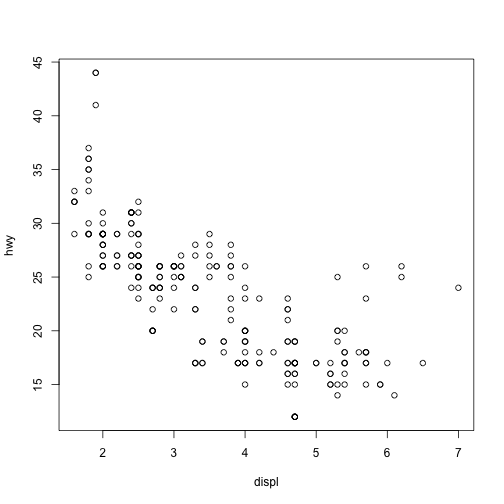
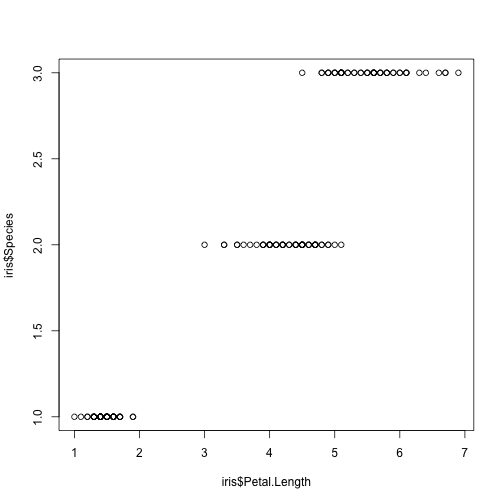
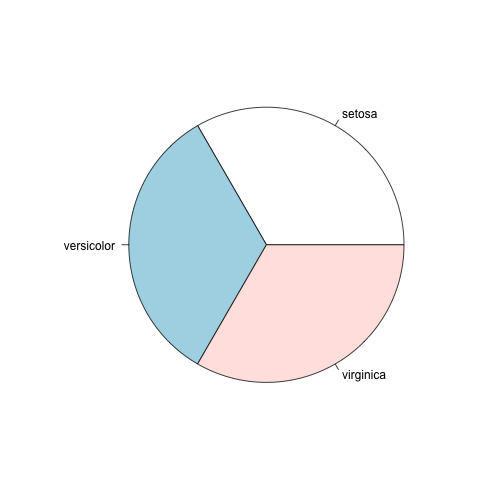

---
title       : Programming in R
subtitle    : A short introduction
author      : Alex Pacheco
job         : LTS Research Computing
logo        : lu.png
framework   : io2012        # {io2012, html5slides, shower, dzslides, ...}
highlighter : highlight.js  # {highlight.js, prettify, highlight}
hitheme     : tomorrow      # 
widgets     : []            # {mathjax, quiz, bootstrap}
mode        : selfcontained # {standalone, draft}
--- .rcr

## Read-And-Delete

1. Edit YAML front matter
2. Write using R Markdown
3. Use an empty line followed by three dashes to separate slides!

--- .rcr

## History

* R is a dialect of the S language
    - S was initiated at the Bell Labs as an internal statistical analysis environment.
    - Most well known implementation is S‐plus (most recent stable release was in 2010)
* R was first announced in 1993.
* The R core group was formed in 1997, who controls the source code of R (written in C)
* R 1.0.0 was released in 2000
* The current version is 3.1.3

--- .rcr

## Features

- R is a dialect of the S language
    - Language designed for statistical analysis
    - Similar syntax
- Available on most platform/OS
- Rich data analysis functionalities and sophisticated graphical capabilities
- Active development and very active community
    - CRAN: The Comprehensive R Archive Network
- Source code and binaries, user contributed packages and documentation
    - More than 6,000 packages available on CRAN as of last week
- Free to use

--- .rcr

## Running R

--- .rcr


## Getting Help

* Command Line

```
?<command name>
??<part of command name/topic>
```

--- .rcr

## Data Classes

* R has five atomic classes
* Numeric
    - Double is equivalent to numeric.
    - Numbers in R are treated as numeric unless specified otherwise.
* Integer
* Complex
* Character
* Logical
    - TRUE or FALSE
* You can convert data from one type to the other using the `as.<Type>` functions

--- .rcr


## Data Objects‐ Vectors

* Vectors can only contain elements of the same class
* Vectors can be constructed by
    -  Using the `c()` function (concatenate)
* Coercion will occur when mixed objects are passed to the `c()` function, as if the `as.<Type>()` function is explicitly called
    -  Using the `vector()` function
* One can use `[index]` to access individual element
    -  Indices start from 1

--- .rcr

## Examples


```r
# "#" indicates comment
# "<-" performs assignment operation (you can use "=" as well, but "<-" is preferred)
# numeric (double is the same as numeric)
d <- c(1,2,3)
# character
d <- c("1","2","3")
# you can covert at object with as.TYPE
# as. numeric changes the character vector created above to numeric
as.numeric(d)
```

```
## [1] 1 2 3
```

```r
# The conversion doesn't always work though
as.numeric("a")
```

```
## Warning: NAs introduced by coercion
```

```
## [1] NA
```

--- .rcr

## Examples (contd)


```r
x <- c(0.5, 0.6) ## numeric
x <- c(TRUE, FALSE) ## logical
x <- c(T, F) ## logical
x <- c("a", "b", "c") ## character
# The ":" operator can be used to generate integer sequences
x <- 9:29 ## integer
x <- c(1+0i, 2+4i) ## complex
x <- vector("numeric", length = 10)
# Coercion will occur when objects of different classes are mixed
y <- c(1.7, "a") ## character
y <- c(TRUE, 2) ## numeric
y <- c("a", TRUE) ## character
# Can also coerce explicitly
x <- 0:6
class(x)
```

```
## [1] "integer"
```

```r
as.logical(x)
```

```
## [1] FALSE  TRUE  TRUE  TRUE  TRUE  TRUE  TRUE
```

--- .rcr


## Vectorized Operations

* Lots of R operations process objects in a vectorized way
    -  more efficient, concise, and easier to read.


```r
x <- 1:4; y <- 6:9
x + y
```

```
## [1]  7  9 11 13
```

```r
x > 2
```

```
## [1] FALSE FALSE  TRUE  TRUE
```

```r
x * y
```

```
## [1]  6 14 24 36
```

```r
print( x[x >= 3] )
```

```
## [1] 3 4
```

--- .rcr


## Data Objects - Matrices

* Matrices are vectors with a dimension attribute
* R matrices can be constructed
    -  Using the `matrix()` function
	  - Passing an dim attribute to a vector
	  -  Using the `cbind()` or `rbind()` functions
* R matrices are constructed column‐wise
* One can use `[<index>,<index>]` to access individual element

--- .rcr


## Example

```r
# Create a matrix using the matrix() function
m <- matrix(1:6, nrow = 2, ncol = 3)
m
```

```
##      [,1] [,2] [,3]
## [1,]    1    3    5
## [2,]    2    4    6
```

```r
dim(m)
```

```
## [1] 2 3
```

```r
attributes(m)
```

```
## $dim
## [1] 2 3
```

```r
# Pass a dim attribute to a vector
m <- 1:10
m
```

```
##  [1]  1  2  3  4  5  6  7  8  9 10
```

```r
dim(m) <- c(2, 5)
m
```

```
##      [,1] [,2] [,3] [,4] [,5]
## [1,]    1    3    5    7    9
## [2,]    2    4    6    8   10
```

```r
# Row binding and column binding
x <- 1:3
y <- 10:12
cbind(x, y)
```

```
##      x  y
## [1,] 1 10
## [2,] 2 11
## [3,] 3 12
```

```r
rbind(x, y)
```

```
##   [,1] [,2] [,3]
## x    1    2    3
## y   10   11   12
```

```r
# Slicing
m <- 1:10
m
```

```
##  [1]  1  2  3  4  5  6  7  8  9 10
```

```r
#m[c(1,2),c(2,4)]
```

--- .rcr


## Data Objects - Lists

* Lists are a special kind of vector that contains objects of different classes
* Lists can be constructed by using the `list()` function
* Lists can be indexed using `[[  ]]`


```r
# Use the list() function to construct a list
x <- list(1, "a", TRUE, 1 + 4i)
x
```

```
## [[1]]
## [1] 1
## 
## [[2]]
## [1] "a"
## 
## [[3]]
## [1] TRUE
## 
## [[4]]
## [1] 1+4i
```

--- .rcr


## Data Objects - Data Frames
* Data frames are used to store tabular data
    -  They are a special type of list where every element of the list has to have the same length
    -  Each element of the list can be thought of as a column
    -  Data frames can store different classes of objects in each column
    -  Data frames also have a special attribute called `row.names`
    -  Data frames are usually created by calling `read.table()` or `read.csv()`
          -  More on this later
    -  Can be converted to a matrix by calling `data.matrix()`

--- .rcr


## Names

* R objects can have names


```r
# Each element in a vector can have a name
x <- 1:3
names(x)
```

```
## NULL
```

```r
names(x) <- c("a","b","c")
names(x)
```

```
## [1] "a" "b" "c"
```

```r
x
```

```
## a b c 
## 1 2 3
```

--- .rcr

## Names (contd)


```r
# Lists
x <- list(a = 1, b = 2, c = 3)
x
```

```
## $a
## [1] 1
## 
## $b
## [1] 2
## 
## $c
## [1] 3
```

```r
# Names can be used to refer to individual element
x$a
```

```
## [1] 1
```

--- .rcr

## Names (contd)


```r
# Columns and rows of matrices
m <- matrix(1:4, nrow = 2, ncol = 2)
dimnames(m) <- list(c("a", "b"), c("c", "d"))
m
```

```
##   c d
## a 1 3
## b 2 4
```

--- .rcr


## Querying Object Attributes

* The `class()` function
* The `str()` function
* The `attributes()` function reveals attributes of an object (does not work with vectors)
    -  Class
    -  Names
    -  Dimensions
    -  Length
    -  User defined attributes
* They work on all objects (including functions)

--- .rcr

## Example


```r
m <- matrix(1:10, nrow = 2, ncol = 5)
str(matrix)
```

```
## function (data = NA, nrow = 1, ncol = 1, byrow = FALSE, dimnames = NULL)
```

```r
str(m)
```

```
##  int [1:2, 1:5] 1 2 3 4 5 6 7 8 9 10
```

```r
str(matrix)
```

```
## function (data = NA, nrow = 1, ncol = 1, byrow = FALSE, dimnames = NULL)
```

```r
str(str)
```

```
## function (object, ...)
```

--- .rcr


## Data Class - Factors

* Factors are used to represent categorical data.
* Factors can be unordered or ordered.
* Factors are treated specially by modelling functions like `lm()` and `glm()`


```r
# Use the factor() function to construct a vector of factors
# The order of levels can be set by the levels keyword
x <- factor(c("yes", "yes", "no", "yes", "no"), levels = c("yes", "no"))
x
```

```
## [1] yes yes no  yes no 
## Levels: yes no
```

--- .rcr


## Date and Time

* R has a Date class for date data while times are represented by POSIX formats
* One can convert a text string to date using the `as.Date()` function
* The `strptime()` function can deal with dates and times in different formats.
* The package "`lubridate`" provides many additional and convenient features


```r
# Dates are stored internally as the number of days since 1970-01-01
x <- as.Date("1970-01-01")
x
```

```
## [1] "1970-01-01"
```

```r
as.numeric(x)
```

```
## [1] 0
```

```r
x+1
```

```
## [1] "1970-01-02"
```

--- .rcr

## Data and Time (contd)


```r
# Times are stored internally as the number of seconds since 1970-01-01
x <- Sys.time() ; x
```

```
## [1] "2015-08-10 10:51:55 EDT"
```

```r
as.numeric(x)
```

```
## [1] 1439218316
```

```r
p <- as.POSIXlt(x)
names(unclass(p))
```

```
##  [1] "sec"    "min"    "hour"   "mday"   "mon"    "year"   "wday"  
##  [8] "yday"   "isdst"  "zone"   "gmtoff"
```

```r
p$sec
```

```
## [1] 55.57873
```

--- .rcr


## Missing Values

* Missing values are denoted by `NA` or `NaN` for undefined mathematical operations.
    - `is.na()` is used to test objects if they are `NA`
    - `is.nan()` is used to test for `NaN`
    - `NA` values have a class also, so there are integer `NA`, character `NA`, etc.
    - A `NaN` value is also `NA` but the converse is not true


```r
x <- c(1,2, NA, 10,3)
is.na(x)
```

```
## [1] FALSE FALSE  TRUE FALSE FALSE
```

```r
is.nan(x)
```

```
## [1] FALSE FALSE FALSE FALSE FALSE
```

--- .rcr

## Missing Values (contd)


```r
x <- c(1,2, NaN, NA,4)
is.na(x)
```

```
## [1] FALSE FALSE  TRUE  TRUE FALSE
```

```r
is.nan(x)
```

```
## [1] FALSE FALSE  TRUE FALSE FALSE
```

--- .rcr

## Arithmetic Functions

<table>
<tr><th>Function</th><th>Description</th></tr>   
<tr><td><code>exp()</code></td><td>     Exponentiation</td></tr>
<tr><td><code>log()</code></td><td>     Natural Logarithm</td></tr>
<tr><td><code>log10()</code></td><td>   Logarithm to base 10</td></tr>
<tr><td><code>sqrt()</code></td><td>    square root</td></tr>
<tr><td><code>abs()</code></td><td>     absolute value</td></tr>
<tr><td><code>sin()</code></td><td>     sine</td></tr>
<tr><td><code>cos()</code></td><td>     cosine</td></tr>
<tr><td><code>floor()</code></td><td>    </td></tr>
<tr><td><code>ceiling()</code></td><td> rounding of numbers</td></tr>
<tr><td><code>round()</code></td><td>   </td></tr>
</table>

--- .rcr

## Simple Statistic Functions

<table border="1">
<tr><th>Function</th><th>Description</th></tr>
<tr><td><code>min()</code></td><td>minimum value</td></tr>
<tr><td><code>max()</code></td><td>maximum value</td></tr>
<tr><td><code>which.min()</code></td><td>location of minimum</td></tr>
<tr><td><code>which.max()</code></td><td>location of maximum</td></tr>
<tr><td><code>pmin()</code></td><td>elementwise minima of several vectors</td></tr>
<tr><td><code>pmax()</code></td><td>elementwise maxima of several vectors</td></tr>
<tr><td><code>sum()</code></td><td>sum of elements of a vector</td></tr>
<tr><td><code>mean()</code></td><td>mean of elements of a vector</td></tr>
<tr><td><code>prod()</code></td><td>products of elements of a vector</td></tr>
</table>

--- .rcr


## Distributions and Random Variables

* For each distribution R provides four functions: density (`d`), cumulative density (`p`), quantile (`q`), and random generation (`r`)
    - The function name is of the form `[d|p|q|r]<name of distribution>`
    - e.g. `qbinom()` gives the quantile of a binomial distribution


<table>
<tr><th>Distribution</th><th>Distribution name in R</th></tr>
<tr><td>Uniform</td><td><code>unif</code></td></tr>
<tr><td>Binomial</td><td><code>binom</code></td></tr>
<tr><td>Poisson</td><td><code>pois</code></td></tr>
<tr><td>Geometric</td><td><code>geom</code></td></tr>
<tr><td>Gamma</td><td><code>gamma</code></td></tr>
<tr><td>Normal</td><td><code>norm</code></td></tr>
<tr><td>Log Normal</td><td><code>lnorm</code></td></tr>
<tr><td>Exponential</td><td><code>exp</code></td></tr>
<tr><td>Student’s t</td><td><code>t</code></td></tr>
</table>

--- .rcr

## Examples: Distributions and Random Variables


```r
# Random generation from a uniform distribution.
runif(10, 2, 4)
```

```
##  [1] 3.538605 2.819273 2.336913 2.505583 2.085999 2.236007 3.075561
##  [8] 3.320564 3.516750 3.402623
```

```r
# You can name the arguments in the function call.
runif(10, min = 2, max = 4)
```

```
##  [1] 2.104683 2.292803 2.360340 2.380251 2.798074 2.619530 2.771393
##  [8] 2.497199 2.354845 3.139912
```

```r
# Given p value and degree of freedom, find the t-value.
qt(p=0.975, df = 8)
```

```
## [1] 2.306004
```

```r
# The inverse of the above function call
pt(2.306, df = 8)
```

```
## [1] 0.9749998
```

--- .rcr

## User Defined Functions
* Similar to other languages, functions in R are defined by using the `function()` directives
* The return value is the last expression in the function body to be evaluated.
* Functions can be nested
* Functions are R objects
    - For example, they can be passed as an argument to other functions

--- .rcr

## Control Structures
* Control structures allow one to control the flow of execution.

<table>
<tr><td><code>if … else</code></td><td>testing a condition</td></tr>
<tr><td><code>for</code></td><td>executing a loop (with fixed number of iterations)</td></tr>
<tr><td><code>while</code></td><td>executing a loop when a condition is true</td></tr>
<tr><td><code>repeat</code></td><td>executing an infinite loop</td></tr>
<tr><td><code>break</code></td><td>breaking the execution of a loop</td></tr>
<tr><td><code>next</code></td><td>skipping to next iteration</td></tr>
<tr><td><code>return</code></td><td>exit a function</td></tr>
</table>

--- .rcr


## Testing conditions


```r
# Comparisons: <,<=,>,>=,==,!=
# Logical operations: !, &&, ||
if(x > 3 && x < 5) {
  print ("x is between 3 and 5")
} else if(x <= 3) {
  print ("x is less or equal to 3")
} else {
  print ("x is greater or equal to 5")
}
```

--- .rcr

## For Loops


```r
x <- c("a", "b", "c", "d")
# These loops have the same effect
# Loop through the indices
for(i in 1:4) {
  print(x[i])
}
```

```
## [1] "a"
## [1] "b"
## [1] "c"
## [1] "d"
```

```r
# Loop using the seq_along() function
for(i in seq_along(x)) {
  print(x[i])
}
```

```
## [1] "a"
## [1] "b"
## [1] "c"
## [1] "d"
```

--- .rcr

## For Loops (contd)


```r
# Loop through the name
for(letter in x) {
  print(letter)
}
```

```
## [1] "a"
## [1] "b"
## [1] "c"
## [1] "d"
```

```r
for(i in 1:4) print(x[i])
```

```
## [1] "a"
## [1] "b"
## [1] "c"
## [1] "d"
```

--- .rcr

## The apply Function
* The `apply()` function evaluate a function over
the margins of an array
    - More concise than the for loops (not necessarily
faster)


```r
# X: array objects
# MARGIN: a vector giving the subscripts which the function will be applied over
# FUN: a function to be applied
str(apply)
```

```
## function (X, MARGIN, FUN, ...)
```

```r
x <- matrix(rnorm(200), 20, 10)
# Row means
apply(x, 1, mean)
```

```
##  [1]  0.48336473  0.16715492  0.05847272  0.20662281  0.04493405
##  [6] -0.08770365  0.15792048 -0.42426222  0.08991266 -0.17797986
## [11]  0.21355459 -0.25231872  0.24166843  0.21750826 -0.32148301
## [16] -0.52486632  0.15192574 -0.22418540  0.07787755 -0.13453577
```

--- .rcr

## The apply Function (contd)


```r
# Column sums
apply(x, 2, sum)
```

```
##  [1] -4.6586360  2.7735746  2.4135653  0.8587932 -4.6059086  0.6846277
##  [7]  5.7661980 -0.6570225 -2.8231048 -0.1162671
```

```r
# 25th and 75th Quantiles for rows
apply(x, 1, quantile, probs = c(0.25, 0.75))
```

```
##           [,1]       [,2]       [,3]       [,4]       [,5]       [,6]
## 25% 0.04222279 0.07638044 -0.3850304 -0.5268029 -0.5506386 -1.0979975
## 75% 0.90594988 0.41129796  0.7435271  0.9055006  0.3120472  0.7158073
##           [,7]       [,8]       [,9]      [,10]      [,11]      [,12]
## 25% -0.3674621 -0.9833996 -0.3099412 -0.9318761 -0.2761282 -0.8480592
## 75%  0.8310799  0.2508075  0.4080987  0.3833054  0.4231146  0.6084039
##          [,13]      [,14]      [,15]       [,16]      [,17]      [,18]
## 25% -0.1187785 -0.2709992 -1.1074485 -1.06048238 -0.7866159 -0.9731407
## 75%  0.8961099  0.8782394  0.3382637 -0.03624711  0.7195462  0.4070229
##          [,19]      [,20]
## 25% -0.6444881 -0.7648423
## 75%  0.8620322  0.7186549
```

--- .rcr

## The apply Function (contd)


```r
dim(x)
```

```
## [1] 20 10
```

```r
# Change the dimensions of x
dim(x) <- c(2,2,50)
# Take average over the first two dimensions
apply(x, c(1, 2), mean)
```

```
##             [,1]        [,2]
## [1,]  0.20236112  0.03726846
## [2,] -0.02104115 -0.22587204
```

```r
rowMeans(x, dims = 2)
```

```
##             [,1]        [,2]
## [1,]  0.20236112  0.03726846
## [2,] -0.02104115 -0.22587204
```

--- .rcr

## Other Apply Functions
* `lapply`: Loop over a list and evaluate a function on each element
* `sapply`: Same as lapply but try to simplify the result
* `tapply`: Apply a function over subsets of a vector
* `mapply`: Multivariate version of lapply

--- .rcr

## Plyr Package
* In data analysis you often need to 
    - split up a big data structure into homogeneous pieces,
    - apply a function to each piece and then
    - combine all the results back together
* This split‐apply‐combine procedure is what
the `plyr` package is for.

--- .rcr

## Example: Plyr Package


```r
library(ggplot2)
library(plyr)
str(mpg)
```

```
## 'data.frame':	234 obs. of  11 variables:
##  $ manufacturer: Factor w/ 15 levels "audi","chevrolet",..: 1 1 1 1 1 1 1 1 1 1 ...
##  $ model       : Factor w/ 38 levels "4runner 4wd",..: 2 2 2 2 2 2 2 3 3 3 ...
##  $ displ       : num  1.8 1.8 2 2 2.8 2.8 3.1 1.8 1.8 2 ...
##  $ year        : Factor w/ 2 levels "1999","2008": 1 1 2 2 1 1 2 1 1 2 ...
##  $ cyl         : int  4 4 4 4 6 6 6 4 4 4 ...
##  $ trans       : Factor w/ 10 levels "auto(av)","auto(l3)",..: 4 9 10 1 4 9 1 9 4 10 ...
##  $ drv         : Factor w/ 3 levels "4","f","r": 2 2 2 2 2 2 2 1 1 1 ...
##  $ cty         : int  18 21 20 21 16 18 18 18 16 20 ...
##  $ hwy         : int  29 29 31 30 26 26 27 26 25 28 ...
##  $ fl          : Factor w/ 5 levels "c","d","e","p",..: 4 4 4 4 4 4 4 4 4 4 ...
##  $ class       : Factor w/ 7 levels "2seater","compact",..: 2 2 2 2 2 2 2 2 2 2 ...
```

```r
str(ddply)
```

```
## function (.data, .variables, .fun = NULL, ..., .progress = "none", 
##     .inform = FALSE, .drop = TRUE, .parallel = FALSE, .paropts = NULL)
```

--- .rcr

## Example (contd)


```r
ddply(mpg, "cyl", summarise, mean = mean(cty))
```

```
##   cyl     mean
## 1   4 21.01235
## 2   5 20.50000
## 3   6 16.21519
## 4   8 12.57143
```

--- .rcr

## Reading and Writing Data
* R understands many different data formats and has lots of ways of reading/writing them

<table>
<tr><th>Funtion (read)</th><th>Function (write)</th><th>Description</th></tr>
<tr><td><code>read.table</code></td><td><code>write.table</code></td><td></td></tr>
<tr><td><code>read.csv</code></td><td><code>write.csv</code></td><td>reading/writing tabular data</td></tr>
<tr><td><code>readLines</code></td><td><code>writeLines</code></td><td>reading/writing lines of a text file</td></tr>
<tr><td><code>source</code></td><td><code>dump</code></td><td>reading/writing in R code files</td></tr>
<tr><td><code>dget</code></td><td><code>dput</code></td><td>reading/writing in R code files</td></tr>
<tr><td><code>load</code></td><td><code>save</code></td><td>reading in/saving workspaces</td></tr>
<tr><td><code>unserialize</code></td><td><code>serialize</code></td><td>reading/writing single R objects in binary form</td></tr>
</table>

--- .rcr

## Reading Data with read.table


```r
str(read.table)
```

```
## function (file, header = FALSE, sep = "", quote = "\"'", dec = ".", 
##     numerals = c("allow.loss", "warn.loss", "no.loss"), row.names, 
##     col.names, as.is = !stringsAsFactors, na.strings = "NA", colClasses = NA, 
##     nrows = -1, skip = 0, check.names = TRUE, fill = !blank.lines.skip, 
##     strip.white = FALSE, blank.lines.skip = TRUE, comment.char = "#", 
##     allowEscapes = FALSE, flush = FALSE, stringsAsFactors = default.stringsAsFactors(), 
##     fileEncoding = "", encoding = "unknown", text, skipNul = FALSE)
```

* `file` ‐ the name of a file, or a connection
* `header` ‐ logical indicating if the file has a header line
* `sep` ‐ a string indicating how the columns are separated
* `colClasses` ‐ a character vector indicating the class of each column in the dataset
* `nrows` ‐ the number of rows in the dataset
* `comment.char` ‐ a character string indicating the comment character
* `skip` ‐ the number of lines to skip from the beginning
* `stringsAsFactors` ‐ should character variables be coded as factors?

--- .rcr

## Reading Data with read.table (contd)

* The function will
    - Skip lines that begin with a #
    - Figure out how many rows there are (and how much memory needs to be allocated)
    - Figure out what type of variable is in each column of the table
* Telling R all these things directly makes R run faster and more efficiently.
* `read.csv()` is identical to `read.table()` except that the default separator is a comma.

--- .rcr

## Graphics in R
* There are three plotting systems in R
    - Base
* Convenient, but hard to adjust after the plot is created
    - Lattice
* Good for creating conditioning plot
    - Ggplot2
* Powerful and flexible, many tunable feature, may require some time to master
* Each has its pros and cons, so it is up to the users which one to choose

--- .rcr

## Graphics - Base

```r
summary(mpg)
```

```
##      manufacturer                 model         displ         year    
##  dodge     :37    caravan 2wd        : 11   Min.   :1.600   1999:117  
##  toyota    :34    ram 1500 pickup 4wd: 10   1st Qu.:2.400   2008:117  
##  volkswagen:27    civic              :  9   Median :3.300             
##  ford      :25    dakota pickup 4wd  :  9   Mean   :3.472             
##  chevrolet :19    jetta              :  9   3rd Qu.:4.600             
##  audi      :18    mustang            :  9   Max.   :7.000             
##  (Other)   :74    (Other)            :177                             
##       cyl               trans    drv          cty             hwy       
##  Min.   :4.000   auto(l4)  :83   4:103   Min.   : 9.00   Min.   :12.00  
##  1st Qu.:4.000   manual(m5):58   f:106   1st Qu.:14.00   1st Qu.:18.00  
##  Median :6.000   auto(l5)  :39   r: 25   Median :17.00   Median :24.00  
##  Mean   :5.889   manual(m6):19           Mean   :16.86   Mean   :23.44  
##  3rd Qu.:8.000   auto(s6)  :16           3rd Qu.:19.00   3rd Qu.:27.00  
##  Max.   :8.000   auto(l6)  : 6           Max.   :35.00   Max.   :44.00  
##                  (Other)   :13                                          
##  fl             class   
##  c:  1   2seater   : 5  
##  d:  5   compact   :47  
##  e:  8   midsize   :41  
##  p: 52   minivan   :11  
##  r:168   pickup    :33  
##          subcompact:35  
##          suv       :62
```

--- .rcr

## Graphics - Base (contd)


```r
plot(hwy ~ displ, data=mpg)
```

 

--- .rcr

## Graphics - Base (contd)


```r
boxplot(hwy ~ class, data = mpg, xlab = "Class", ylab = "High Way Mileage")
```

 

--- .rcr

## Graphics - Lattice


```r
mpg <- transform(mpg, year = factor(year)) 
xyplot(hwy ~ displ | year*drv, mpg, layout = c(6,1))
```

 

--- .rcr

## Graphics - ggplot2

```r
qplot(displ, cty, data = mpg, color = drv)
```

 

--- .rcr

## Graphics - ggplot2

```r
qplot(displ, hwy, data = mpg, facets = drv ~ year)
```

 


```r
ggplot(emiByType, aes(year, sum, colour = type)) +
 geom_point(size = 5) +
 geom_line(size = 1) +
 ggtitle("Total Emission in Baltimore City by Source Type") +
 labs(x = "Year", y = "Total Emissions (ton)", fontsize = 20) +
 theme_economist() + scale_colour_economist() +
 theme(axis.title=element_text(size=14,face="bold"), legend.title =
   element_text(size = rel(1.5), face = "bold"))
```

--- .rcr &twocol

## Histograms

*** =left


```r
library(RColorBrewer)
data(VADeaths)
par(mfrow=c(2,3))
hist(VADeaths,breaks=10, col=brewer.pal(3,"Set3"),main="Set3 3 colors")
hist(VADeaths,breaks=3 ,col=brewer.pal(3,"Set2"),main="Set2 3 colors")
hist(VADeaths,breaks=7, col=brewer.pal(3,"Set1"),main="Set1 3 colors")
hist(VADeaths,,breaks= 2, col=brewer.pal(8,"Set3"),main="Set3 8 colors")
hist(VADeaths,col=brewer.pal(8,"Greys"),main="Greys 8 colors")
hist(VADeaths,col=brewer.pal(8,"Greens"),main="Greens 8 colors")
```

*** =right

 

***

--- .rcr

## Line Chart


```r
plot(AirPassengers,type="l")  #Simple Line Plot
```

 

--- .rcr &twocol_width

## Bar Chart

*** =left width:48%

```r
barplot(iris$Petal.Length) #Creating simple Bar Graph
```

 
*** =right width:48%

```r
barplot(iris$Sepal.Length,col  = brewer.pal(3,"Set1"))
```

 
***

--- .rcr
## Bar Chart

```r
barplot(table(iris$Species,iris$Sepal.Length),col  = brewer.pal(3,"Set1")) #Stacked Plot
```

 

--- .rcr

## Box Plot

```r
boxplot(iris$Petal.Length~iris$Species) #Creating Box Plot between two variable
```

 

--- .rcr &twocol_width

## Box Plot

*** =left width:48%


```r
data(iris)
par(mfrow=c(2,2))
boxplot(iris$Sepal.Length,col="red")
boxplot(iris$Sepal.Length~iris$Species,col="red")
boxplot(iris$Sepal.Length~iris$Species,col=heat.colors(3))
boxplot(iris$Sepal.Length~iris$Species,col=topo.colors(3))
```

*** =right width:48%

 

***

--- .rcr

## Scatter Plots

```r
plot(x=iris$Petal.Length) #Simple Scatter Plot
```

 

```r
plot(x=iris$Petal.Length,y=iris$Species) #Multivariate Scatter Plot
```

 

```r
plot(iris,col=brewer.pal(3,"Set1"))
```

 

```r
pie(table(iris$Species))
```

 

--- .rcr &twocol_width

## Hexbin Binning

* We can use the hexbin package in case we have multiple points in the same place (overplotting). Hexagon binning is a form of bivariate histogram useful for visualizing the structure in datasets with large n. 

*** =left width:48%


```r
#library(ggplot2) to get diamonds dataset
library(hexbin)
a=hexbin(diamonds$price,diamonds$carat,xbins=40)
library(RColorBrewer)
plot(a)
```

*** =right width:48%


***

--- .rcr 

## (Contd)


```r
# We can also create a color palette and then use the hexbin plot function for a better visual effect. 
rf <- colorRampPalette(rev(brewer.pal(40,'Set3')))
hexbinplot(diamonds$price~diamonds$carat, data=diamonds, colramp=rf)
```


--- .rcr

## Mosaic Plot

* A mosaic plot can be used for plotting categorical data very effectively with the area of the data showing the relative proportions.

```r
data(HairEyeColor)
mosaicplot(HairEyeColor)
```


--- .rcr

## Heat Map

* Heat maps enable you to do exploratory data analysis with two dimensions as the axis and the third dimension shown by intensity of color. 
* However you need to convert the dataset to a matrix format. Here’s the code:


```r
heatmap(as.matrix(mtcars))
```


--- .rcr

## Heat Map (contd)

* You can use `image()` command also for this type of visualization as:

```r
image(as.matrix(mtcars[2:7]))
```


--- .rcr &twocol_width

## 3D Graphs

*** =left width:48%

* Install package R Commander 
`install.packages("Rcmdr")`
* Install Lattice package
* Correlogram (GUIs)

Correlogram help us visualize the data in correlation matrices. Here’s the code:


```r
cor(iris[1:4])
```

```
##              Sepal.Length Sepal.Width Petal.Length Petal.Width
## Sepal.Length    1.0000000  -0.1175698    0.8717538   0.8179411
## Sepal.Width    -0.1175698   1.0000000   -0.4284401  -0.3661259
## Petal.Length    0.8717538  -0.4284401    1.0000000   0.9628654
## Petal.Width     0.8179411  -0.3661259    0.9628654   1.0000000
```

*** =right width:48%


```r
corrgram(iris)
```


***

--- .rcr


## Slide with R Code and Output


```r
summary(cars)
```

```
##      speed           dist       
##  Min.   : 4.0   Min.   :  2.00  
##  1st Qu.:12.0   1st Qu.: 26.00  
##  Median :15.0   Median : 36.00  
##  Mean   :15.4   Mean   : 42.98  
##  3rd Qu.:19.0   3rd Qu.: 56.00  
##  Max.   :25.0   Max.   :120.00
```

--- .rcr

## Slide with Plot


```r
plot(cars)
```

 


